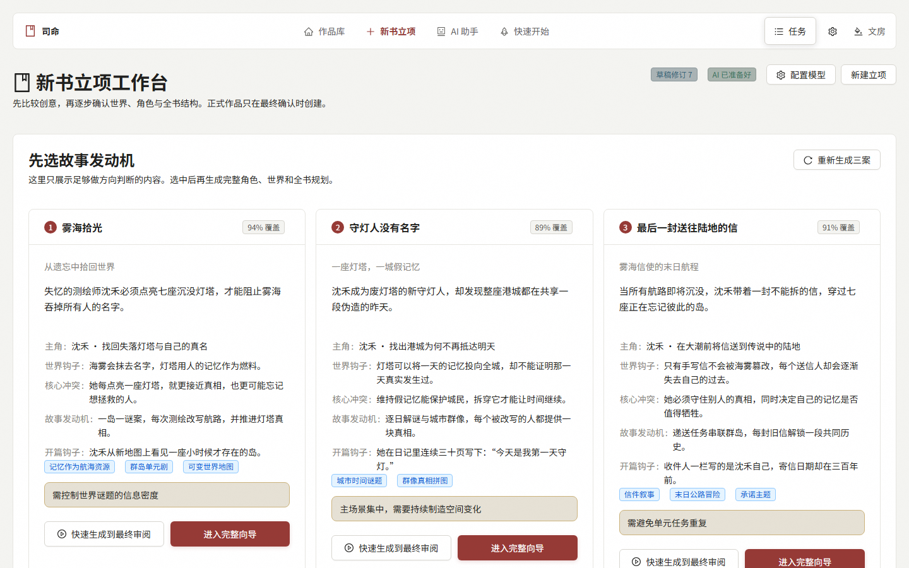
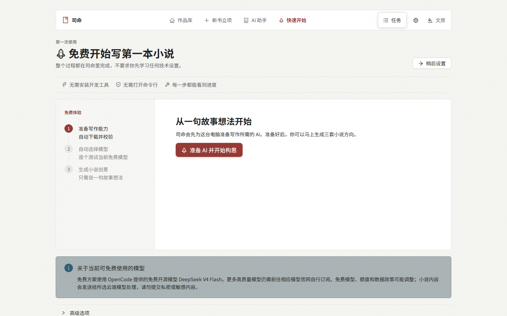
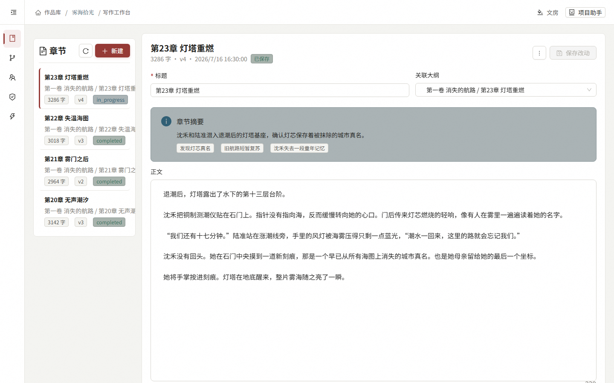
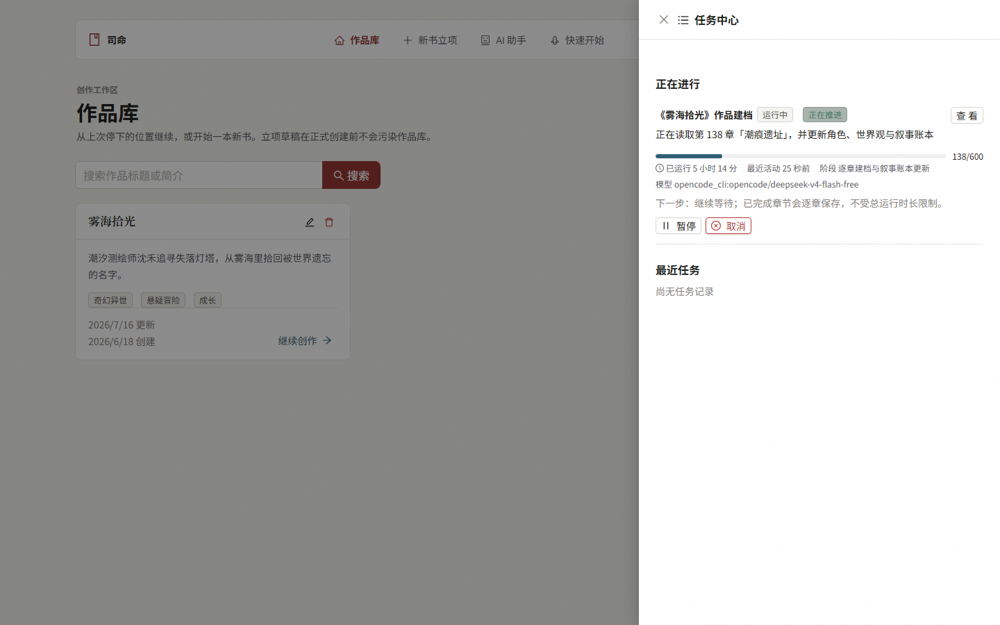

# 司命 / Siming

**长篇小说的命运织机。**

Siming is a free and open-source, local-first AI workspace for planning, writing, archiving, and maintaining continuity in long-form fiction.

[](https://github.com/teangtang1122/siming-ai/releases/latest)


[](https://github.com/teangtang1122/siming-ai/actions/workflows/backend-ci.yml)
[](https://github.com/teangtang1122/siming-ai/actions/workflows/frontend-ci.yml)
[](LICENSE)

[下载 Windows 安装版](https://github.com/teangtang1122/siming-ai/releases/latest/download/Siming-Setup.exe) · [Gitee 镜像下载（大陆网络较慢时备用）](https://gitee.com/teangtang13/siming-ai/releases) · [跨设备指南](docs/gateway-mobile.md) · [反馈问题](https://github.com/teangtang1122/siming-ai/issues/new/choose) · [版本记录](https://github.com/teangtang1122/siming-ai/releases)

> **系统要求：Windows 10 x64 或更高版本。Windows 7、Windows 8/8.1 以及 32 位 Windows 不在支持范围内。**

> 💬 **用户交流 QQ 群：814283606**  
> 欢迎交流使用体验、小说创作方法与功能建议。大陆地区访问 GitHub 下载较慢时，可使用 [Gitee 同步镜像 Releases](https://gitee.com/teangtang13/siming-ai/releases) 备用下载；下载后请核对版本号与对应的 SHA-256。

[](docs/images/readme/novel-creation.png)

*新书立项工作台：先形成一套故事方向，再通过对话持续调整角色、世界观、卷纲和前 3 章细纲。图中内容均为虚构演示数据。*

> **3.1.13 测试版** 将立项数据纳入作品上下文：多个对话可共享同一份立项，旧对话恢复自己的立项数据，正式作品可继续编辑来源立项；未选择上下文时首次发言会自动新建立项。AI 会先读取现有结构化数据，边追问边增量补充，而不是采访结束后一次性生成。历史变更请查看 [GitHub Releases](https://github.com/teangtang1122/siming-ai/releases)。

## 它解决什么问题

用通用大模型直接写长篇，真正难的往往不是生成一段文字，而是让几百章的事实持续一致：

- 角色的年龄、外貌、位置、伤势、目标和关系会随时间变化。
- 大纲、正文、世界观、伏笔和时间线容易分散，写后还需要反复手工同步。
- 几十万字无法一次塞进模型，只靠聊天记忆很快就会丢失前文。
- API、Claude Code、Codex、OpenCode 等入口的能力和错误提示不一致，长任务也很难判断是在计算还是真的卡住。

司命把正文、大纲、角色状态、世界观、叙事账本和 AI 工作流放在同一个本地项目中。数据库是权威写入源，Markdown/JSON 文件作为可阅读镜像；修改通过司命工具落库，让前端、索引、版本历史和文件保持一致。

项目采用 Apache 2.0 许可证，软件本身永久免费、源码公开。你可以从一句创意建立新小说，也可以导入已有 TXT 小说完成建档后续写或二创。写作时会按章节选取角色当前状态、世界规则、时间线、伏笔和未解决动作，并在写后更新叙事账本，尽量减少人物失真和 OOC；模型生成仍建议由作者最终审阅。

## 3 分钟开始

### 1. 下载并安装

在 Windows 10 x64 或更高版本上，从 [官方 GitHub Release](https://github.com/teangtang1122/siming-ai/releases/latest) 下载 `Siming-Setup.exe` 并运行安装向导。你可以选择安装目录；安装器会询问是否创建桌面快捷方式，默认勾选。普通使用者不需要安装 Python、Node.js，也不需要打开 CMD 或 PowerShell。Windows 7、Windows 8/8.1 和 32 位 Windows 不受支持。

默认程序目录为 `%LOCALAPPDATA%\Programs\Siming`。程序文件和小说数据相互独立：小说数据默认仍使用 `%LOCALAPPDATA%\Siming`，旧版 `%LOCALAPPDATA%\Moshu` 和 `%LOCALAPPDATA%\NovelWritingAgent` 数据会兼容读取，不会被主动删除。

### 2. 点击“准备 AI 并开始构思”

没有任何模型配置时，司命会为 Windows 自动下载、校验并测试 OpenCode，整个过程都在图形界面里完成。测试通过后才会把模型标记为可用。

免费方案当前使用 OpenCode 提供的免费开源模型 DeepSeek V4 Flash，运行时会显示完整模型 ID：

```text
opencode_cli:opencode/deepseek-v4-flash-free
```

免费模型、额度与数据政策由对应服务提供方决定，可能随时调整。若实际模型发生切换，司命会在运行记录中明确显示；更多高质量模型仍需前往相应模型官网自行订阅。

### 3. 说一句故事想法

输入一句梗概，司命会先形成一套轻量创意方向。之后可直接在聊天中持续调整，也可以使用完整向导逐步确认角色、世界观、卷纲和前 3 章细纲。正式作品只会在最终确认时创建。

## 界面预览

| 首次准备 AI | 作品写作工作台 |
| --- | --- |
| [](docs/images/readme/quick-start.png) | [](docs/images/readme/project-workspace.png) |
| 不需要开发工具或命令行，下载、校验和模型测试都有明确步骤。 | 章节、大纲节点、摘要、正文与版本历史在同一工作台内管理。 |

[](docs/images/readme/task-center.png)

*全局任务中心：跨页面查看当前阶段、处理对象、模型、已用时间和运行健康度。建档和拆书不设总时限，只会在输出、工具、进程和业务检查点都长时间没有变化时判定卡住。*

> 四张截图均由 `npm run screenshots:readme` 使用真实前端与稳定的虚构数据生成，不读取本机作品、路径、凭据或模型账户。

## 核心能力

| 能力 | 作者能得到什么 |
| --- | --- |
| 新书立项 | 一套可持续对话调整的创意方向、可编辑的分阶段向导、全书卷纲与前 3 章细纲；每章包含 2–6 个场景节点。 |
| 作品建档 | 逐章提取摘要、大纲、角色状态、关系、世界观、时间线、伏笔与故事线，可从检查点继续。 |
| 写作与上下文 | 按任务预算选择大纲、场景、近期摘要、角色当前状态、有效线索和未解决动作，避免整本书硬塞给模型。 |
| 叙事账本 | 跟踪已完成节拍、已揭露线索、读者承诺和故事线状态，写后归档并为下一章注入关键事实。 |
| 版本与回退 | 每次写章前后保留快照；对新章不满意时，可查看差异并恢复旧版，同步回退相关档案和文件镜像。 |
| 长任务运行 | 展示阶段、最近活动、模型和健康度；支持暂停、继续、取消和重试当前单元，已完成章节不会因后续失败而丢失。 |
| 跨设备创作 | Android 保留可写离线副本；Gateway 按有序修订同步并在分岔时保留双方版本，不静默覆盖。 |

## Android 与自己的 Gateway

司命没有官方小说数据服务器。Android 客户端连接的是你在桌面端启用或用 Docker 部署的 Gateway：

- 桌面内置 Gateway：适合电脑开机时同步，仍可使用桌面本地模型、OpenCode、CLI 和 MCP。
- Docker Gateway：适合 NAS、家中常开主机或云主机，提供同步和云端 API 写作；镜像不启用本地模型、OpenCode、CLI、MCP 或训练能力。
- 手机在线编辑调用与 PC 前端相同的创作 API；项目助手可逐轮选择 PC 已配置模型或手机私有 Key，两者都执行 PC 的完整提示词与工具链。没有 Gateway 时，手机 Key 使用从 PC 源码自动导出的提示词/工具契约在设备上独立执行。
- 手机端：可新建或导入 TXT，编辑章节、大纲、角色、世界观、伏笔与治理资料；离线照常写，联网后先上传再拉取。

局域网可以直接连接；跨网络推荐 [Tailscale](https://tailscale.com/) 或自己配置 HTTPS。只有已显式加入同步的作品才会进入 Gateway，首次建档前会自动备份并核对数量与摘要哈希。完整部署、配对、备份和恢复步骤见 [Android 与 Gateway 指南](docs/gateway-mobile.md)，安全边界见 [Gateway 威胁模型](docs/security/gateway-threat-model.md)。

最小 Docker 启动示例：

```powershell
$env:SIMING_GATEWAY_BOOTSTRAP_KEY = "请换成至少12位的随机管理口令"
docker compose -f compose.gateway.yml up -d
```

管理页默认位于 `http://你的设备地址:8000`。口令只用于换取当前浏览器的 HttpOnly 管理会话，不写入浏览器存储。

## 模型与隐私

司命可以使用 OpenAI、Anthropic Claude、DeepSeek、Google Gemini、通义千问、OpenAI 兼容中转站，也可以调用 Claude Code、Codex、OpenCode 等本机 CLI。仅“检测到命令”不等于可用；只有完成真实对话测试的模型才会进入新书、助手和写作流程。

- 作品数据库、文件镜像、快照和任务记录保存在你选择的本机目录。
- 司命不会自主把整个作品库上传到项目服务器。
- 使用云端 API 或需联网的 CLI 时，当前任务选中的提示词、正文片段和上下文会发送给对应提供方处理。
- API Key 由本机配置使用；OpenCode 的一次性登录凭据仅传递给当前登录进程，不保存、不回显、不写日志。

请根据内容敏感程度阅读所选模型提供方的数据政策，不要向免费云端模型提交隐私或机密内容。

## 下载与信任

Windows 正式下载资产现在以 `Siming-Setup.exe` 为主，`Siming.exe` 仅保留为历史单文件客户端的兼容升级桥。应用内安装包更新要求 SHA-256 与发布校验值一致，并通过可信 Windows Authenticode 签名校验；未签名发布只能供用户主动下载和手动安装，安全更新器不会静默放宽这一要求。

为减少供应链风险：

1. 只从 [`teangtang1122/siming-ai` 官方 Releases](https://github.com/teangtang1122/siming-ai/releases) 或 [Gitee 同步镜像 Releases](https://gitee.com/teangtang13/siming-ai/releases) 下载。
2. 下载同一版本的 `Siming-Setup.sha256`，用 `certutil -hashfile Siming-Setup.exe SHA256` 计算文件哈希并与其对照。
3. 不要使用网盘、聊天群或第三方网站二次分发的安装包或 EXE。

Windows Release 同时保留 `Siming-Setup.exe`、`Siming-Setup.sha256`、`Siming.exe`、`update.json`、`sha256.txt`；Android 提供 `Siming.apk` 与 `Siming-apk-sha256.txt`。旧单 EXE 用户收到兼容更新后，会由新更新器引导迁移到可选择安装目录的安装版；安装完成后的后续更新则使用已验证安装包覆盖原安装目录。

## 外部 Agent 与提示词投稿

司命支持让 Claude Code、Codex、OpenCode 等外部 Agent 通过 MCP 读取项目上下文。镜像文件可以直接读取；章节、角色、大纲和世界观的新建或修改必须通过司命工具入库，不把“直接写出一个 Markdown 文件”当作完成。

提示词贡献不要求作者掌握 Git。在作品的“提示词投稿”页面中，可以直接修改快速模式或质量模式提示词，补充改动说明、预期效果和测试记录，然后生成投稿包和预填好的 GitHub Issue。

专业文档：

- [外部 Agent 无 API 写作](docs/agent/external-no-api-writing.md)
- [外部 Agent 无 API 建档](docs/agent/external-no-api-cataloging.md)
- [MCP 权限包与工具](docs/mcp/permission-packs-and-tools.md)
- [MCP 安全边界](docs/mcp/security.md)

## 开发与贡献

普通使用者只需要 `Siming-Setup.exe`。以下环境仅面向源码贡献者。

```powershell
# 后端
cd backend
python -m venv .venv
.\.venv\Scripts\activate
pip install -r requirements.txt
uvicorn app.main:app --reload

# 前端（新终端）
cd frontend
npm install
npm run dev
```

提交前的常用检查：

```powershell
backend\.venv\Scripts\python.exe -m pytest backend/tests -q
npm --prefix frontend run lint
npm --prefix frontend test
npm --prefix frontend run build
npm --prefix frontend run test:e2e
npm --prefix frontend run screenshots:readme
cd mobile\android
.\gradlew.bat testDebugUnitTest lintDebug assembleDebug
```

本地桌面完整打包使用 `.\build-installer.bat`；只构建历史兼容单 EXE 可使用 `.\build-exe.bat`。签名 APK 使用 `.\scripts\build-android-release.ps1`（签名凭据只通过环境变量提供）。提交代码、文档、可复现问题或者通过 GUI 生成的提示词投稿都很欢迎。

## 路线图与许可证

- [项目路线图](docs/roadmap.md)
- [项目管理与发布约定](docs/project-management.md)
- [全部版本发布记录](https://github.com/teangtang1122/siming-ai/releases)
- [功能建议与问题反馈](https://github.com/teangtang1122/siming-ai/issues)

本项目采用 [Apache License 2.0](LICENSE)。
