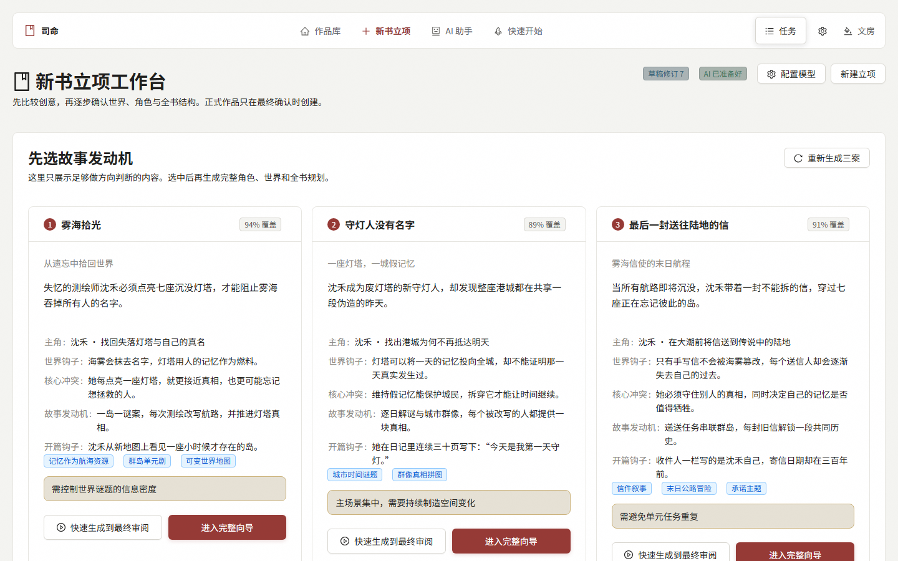
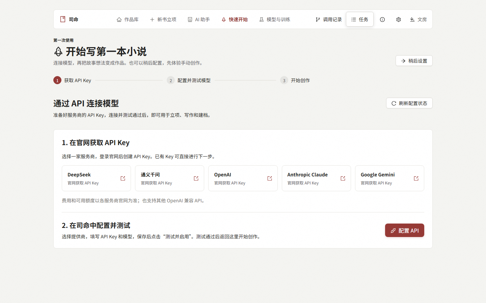
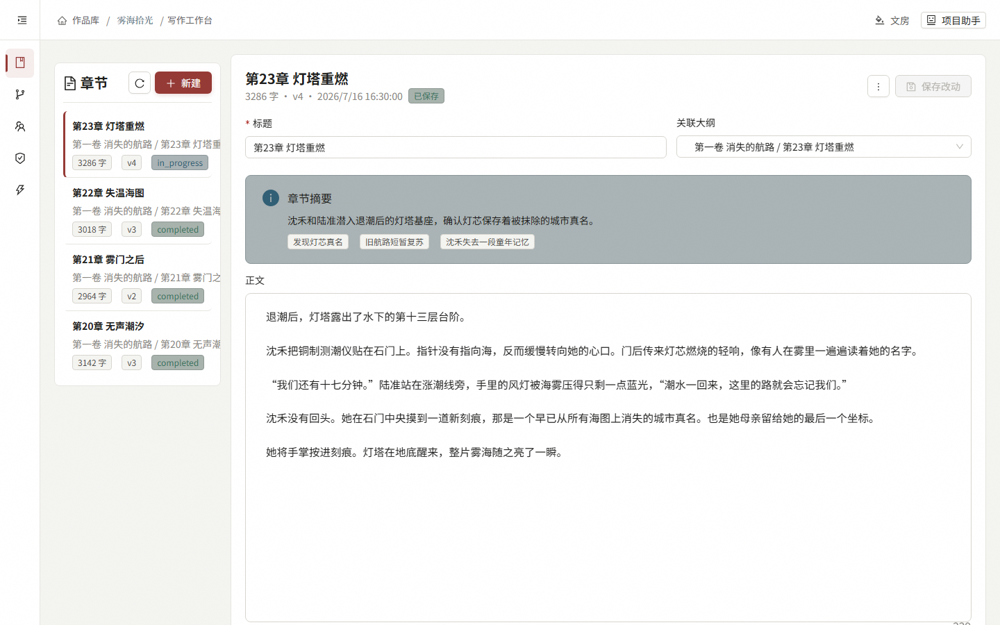
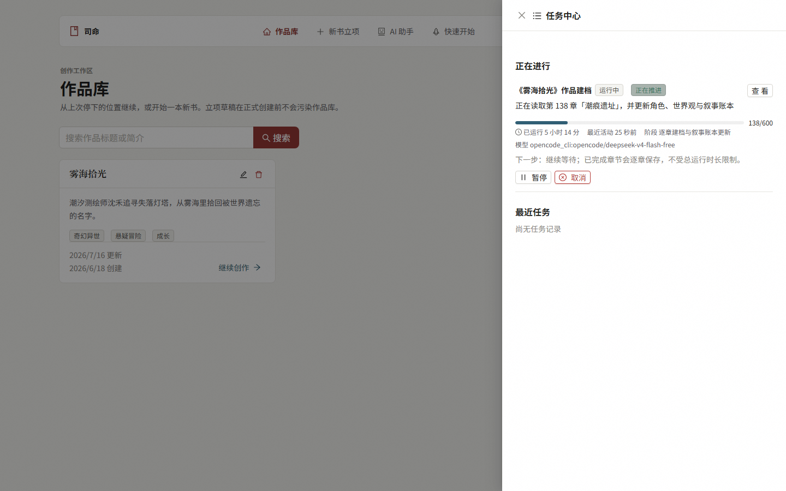

# 司命 / Siming

**长篇小说的命运织机。**

Siming is a free and open-source, local-first AI workspace for planning, writing, archiving, and maintaining continuity in long-form fiction.

<p align="center">
  
  <br />
  <sub>你慢慢写，司命陪着你。</sub>
</p>

[](https://github.com/teangtang1122/siming-ai/releases/latest)


[](https://github.com/teangtang1122/siming-ai/actions/workflows/backend-ci.yml)
[](https://github.com/teangtang1122/siming-ai/actions/workflows/frontend-ci.yml)
[](LICENSE)

[下载 Windows 安装版](https://github.com/teangtang1122/siming-ai/releases/latest/download/Siming-Setup.exe) · [Gitee 镜像下载（大陆网络较慢时备用）](https://gitee.com/teangtang13/siming-ai/releases) · [本地模型](#本地模型) · [跨设备指南](docs/gateway-mobile.md) · [反馈问题](https://github.com/teangtang1122/siming-ai/issues/new/choose) · [版本记录](https://github.com/teangtang1122/siming-ai/releases)

> **系统要求：Windows 10 x64 或更高版本。Windows 7、Windows 8/8.1 以及 32 位 Windows 不在支持范围内。**

> 💬 **用户交流 QQ 群：814283606**  
> 欢迎交流使用体验、小说创作方法与功能建议。大陆地区访问 GitHub 下载较慢时，可使用 [Gitee 同步镜像 Releases](https://gitee.com/teangtang13/siming-ai/releases) 备用下载；下载后请核对版本号与对应的 SHA-256。

[](docs/images/readme/novel-creation.png)

*新书立项工作台：先形成一套故事方向，再通过对话持续调整角色、世界观、卷纲和前 3 章细纲。图中内容均为虚构演示数据。*

> **当前版本 3.5.1**：快速开始简化为 API 接入，提供获取 API Key 的官网入口；改进手机书架、书内导航和立项编辑；修复 Windows 升级时旧运行库被占用的问题，并更新 OpenCode 模型发现。PC、Android 和 Gateway 同步版本号。完整变化见 [3.5.1 发布说明](docs/release-notes-3.5.1.md)。
>
> **本地模型实测：Qwen3.8 27B Q3 在 64K 上下文配置下已成功完成立项、写作、建档等完整流程；这表示该配置跑通过全流程，不代表所有轮次都不会失败。硬件、速度及验证边界见[本机评估](docs/qa/2026-09-24-qwen38-27b-local-evaluation.md)和下方[本地模型](#本地模型)。其他模型与 CLI 的可用性以实际连接测试为准。**

## 它解决什么问题

用通用大模型直接写长篇，真正难的往往不是生成一段文字，而是让几百章的事实持续一致：

- 角色的年龄、外貌、位置、伤势、目标和关系会随时间变化。
- 大纲、正文、世界观、伏笔和时间线容易分散，写后还需要反复手工同步。
- 几十万字无法一次塞进模型，只靠聊天记忆很快就会丢失前文。
- API、Claude Code、Codex、OpenCode 等入口的能力和错误提示不一致，长任务也很难判断是在计算还是真的卡住。

司命把正文、大纲、角色状态、世界观、叙事账本和 AI 工作流放在同一个本地项目中。数据库是权威写入源，Markdown/JSON 文件作为可阅读镜像；修改通过司命工具落库，让前端、索引、版本历史和文件保持一致。

项目采用 Apache 2.0 许可证，软件本身永久免费、源码公开。你可以从一句创意建立新小说，也可以导入已有 TXT 小说完成建档后续写或二创。写作时会按章节选取角色当前状态、世界规则、时间线、伏笔和未解决动作，并在写后更新叙事账本，尽量减少人物失真和 OOC；模型生成仍建议由作者最终审阅。

## 3 分钟开始

### 1. 下载并安装

在 Windows 10 x64 或更高版本上，从 [官方 GitHub Release](https://github.com/teangtang1122/siming-ai/releases/latest) 下载 `Siming-Setup.exe` 并运行安装向导。你可以选择安装目录；安装器会询问是否创建桌面快捷方式，默认勾选。普通使用者不需要安装 Python、Node.js，也不需要打开 CMD 或 PowerShell。Windows 7、Windows 8/8.1 和 32 位 Windows 不受支持。

默认程序目录为 `%LOCALAPPDATA%\Programs\Siming`。程序文件和小说数据相互独立：小说数据默认仍使用 `%LOCALAPPDATA%\Siming`，旧版 `%LOCALAPPDATA%\Moshu` 和 `%LOCALAPPDATA%\NovelWritingAgent` 数据会兼容读取，不会被主动删除。

### 2. 获取 API Key 并连接

快速开始只提供 API 接入。先选择一家服务商，前往官网创建 API Key；已有 Key 可直接配置：

| 服务商 | 获取 API Key 的官网 |
| --- | --- |
| DeepSeek | [DeepSeek 开放平台](https://platform.deepseek.com/api_keys) |
| 通义千问 | [阿里云百炼](https://bailian.console.aliyun.com/cn-beijing/model/settings/api-key) |
| OpenAI | [OpenAI Platform](https://platform.openai.com/api-keys) |
| Anthropic Claude | [Claude Platform](https://platform.claude.com/settings/keys) |
| Google Gemini | [Google AI Studio](https://aistudio.google.com/apikey) |

获取后返回司命，点击“配置 API”，选择提供商，填写 API Key 和模型，保存后点击“测试并启用”。也支持自定义 OpenAI 兼容 API；费用和额度以服务商官网为准。通过真实对话测试后，返回快速开始即可输入故事想法。已有可用模型时直接进入创作；也可以选择“稍后设置”，先导入或手动编辑作品。

需要本地模型或已有 CLI 时，可分别前往“模型中心”或“模型设置”；详见[本地模型](#本地模型)。

手机端可直接配置自己的 API 独立创作；使用电脑上的模型时，需显式连接自己的 Gateway。Docker Gateway 只提供云端 API 接入。

### 3. 说一句故事想法

输入一句梗概，司命会先形成一套轻量创意方向。之后可直接在聊天中持续调整，也可以使用完整向导逐步确认角色、世界观、卷纲和前 3 章细纲。正式作品只会在最终确认时创建。

## 界面预览

| 首次准备 AI | 作品写作工作台 |
| --- | --- |
| [](docs/images/readme/quick-start.png) | [](docs/images/readme/project-workspace.png) |
| 从服务商官网获取 API Key，配置并测试后开始创作。 | 章节、大纲节点、摘要、正文与版本历史在同一工作台内管理。 |

[](docs/images/readme/task-center.png)

*全局任务中心：跨页面查看当前阶段、处理对象、模型、已用时间和运行健康度。建档和拆书不设总时限，只会在输出、工具、进程和业务检查点都长时间没有变化时判定卡住。*

> 四张截图均由 `npm run screenshots:readme` 使用真实前端与稳定的虚构数据生成，不读取本机作品、路径、凭据或模型账户。

## 核心能力

| 能力 | 作者能得到什么 |
| --- | --- |
| 新书立项 | 一套可持续对话调整的创意方向、可编辑的分阶段向导、全书卷纲与前 3 章细纲；每章包含 2–6 个场景节点。 |
| 作品建档 | 逐章提取摘要、大纲、角色状态、关系、世界观、时间线、伏笔与故事线，可从检查点继续。 |
| 写作与上下文 | 按任务预算选择大纲、场景、近期摘要、角色当前状态、有效线索和未解决动作，避免整本书硬塞给模型。 |
| 本地模型 | 在 Windows 管理 llama.cpp 与 GGUF，使用自己的 GPU 进行立项、写作、建档和评估；可与 API、CLI 分别按任务配置。 |
| 叙事账本 | 跟踪已完成节拍、已揭露线索、读者承诺和故事线状态，写后归档并为下一章注入关键事实。 |
| 版本与回退 | 每次写章前后保留快照；对新章不满意时，可查看差异并恢复旧版，同步回退相关档案和文件镜像。 |
| 长任务运行 | 展示阶段、最近活动、模型和健康度；支持暂停、继续、取消和重试当前单元，已完成章节不会因后续失败而丢失。 |
| 司命桌宠 | Windows 透明悬浮角色直接展示待机、思考、写作、等待作者、完成和错误状态；只负责状态与导航，不写入作品。详见[桌宠设计与开发边界](docs/desktop-pet.md)。 |
| 跨设备创作 | Android 保留可写离线副本；Gateway 按有序修订同步并在分岔时保留双方版本，不静默覆盖。 |

## 陪你写作的司命

她抱着书，安静地陪着你。Windows 桌面模式下，轻点司命会显示一句带颜文字的气泡，约 5 秒后收起；拖动时会换成被拎起的姿势，放到屏幕边缘就会探头。长时间空闲时，她也可能抱书打盹。

<table>
  <tr>
    <td align="center" width="50%">
      <br />
      <strong>读书</strong><br />
      <sub>陪你找灵感。</sub>
    </td>
    <td align="center" width="50%">
      <br />
      <strong>探头</strong><br />
      <sub>我就在旁边。|ω･)</sub>
    </td>
  </tr>
  <tr>
    <td align="center" width="50%">
      <br />
      <strong>打盹</strong><br />
      <sub>休息一会儿。</sub>
    </td>
    <td align="center" width="50%">
      <br />
      <strong>被拎起</strong><br />
      <sub>换个地方，继续陪你。</sub>
    </td>
  </tr>
</table>

以上是 3.5.0 内置素材的静态姿势预览，配文仅作形象介绍；实际桌宠还会眨眼并播放轻量动作。右键可以调整大小、透明度、置顶与静音；双击回到书斋。她只展示任务状态、提供导航，不会代替你保存、确认或续写作品。使用方式与实现边界见 [桌宠说明](docs/desktop-pet.md)。

## 本地模型

Windows 桌面版可以通过 llama.cpp 在本机运行 GGUF。选择“司命本地 AI”后，模型推理和作品工具执行均在自己的电脑上完成，无需云端 API Key；首次下载运行时和模型需要联网。模型中心支持下载内置模型，也支持登记已有 GGUF 或自有模型。模型目录可以放到其他磁盘，登记已有文件会直接使用原路径，不复制文件。

### 配置步骤

1. 打开左侧“模型与训练”，开启“允许使用本地模型”。
2. 点击“下载运行时”，或用“使用本机 llama-server.exe”选择已有运行时。
3. 在模型目录选择模型。以已实测的 Qwen3.8 27B UD-Q3_K_XL 为例，可下载安装，或点击“登记已有 GGUF”选择已有文件；该目录项会核对 GGUF 和 SHA-256。
4. 点击“启动参数”。默认启动上下文为 32K；复现当前成功完成全流程测试的配置时，将上下文设为 **64K（65,536 token）**，再点“保存并启动”。此 Q3 模型默认使用 Q4 KV 缓存、Flash Attention、MTP 2 和 2GB 内存缓存；保存的参数同时用于手动启动和任务自动启动。
5. 启动并通过验证后，点击“设为默认”。也可在“系统设置”为项目助手、立项与大纲、建档、写作、质量评估和拆书分别指定模型。选择优先级为 **本次任务明确选择 > 任务默认 > 全局默认**。
6. “停止当前模型”释放当前运行进程；下次任务可能自动启动。关闭“允许使用本地模型”可以同时停止进程并阻止自动启动。

### 硬件与实测范围

| 模型 | 模型中心初始硬件建议 | 默认启动上下文 | 验证范围 |
| --- | --- | --- | --- |
| Qwen3.8 27B UD-Q3_K_XL（文本） | 16GB NVIDIA 显存，约 32GB 系统内存 | 32K | RTX 4060 Ti 16GB 本机实测，**64K 上下文全流程测试通过** |
| Qwen3.8 27B UD-Q4_K_XL | 24GB 及以上 NVIDIA 显存，约 32GB 系统内存 | 32K | 模型目录建议，未完成上述同等范围的实机验证 |

Q3 模型文件约 13.1GB。内置 Q3 选项只安装文本模型，不包含视觉投影。未满足上述硬件条件时可以自行登记其他 GGUF，具体能否运行取决于模型、可用内存与启动参数。

在 RTX 4060 Ti 16GB、31.6GB 内存、llama.cpp b10566 的[本机评估](docs/qa/2026-09-24-qwen38-27b-local-evaluation.md)中，Q3 的 32K 和 64K 上下文都完成了探针任务；64K 占用更多显存，默认 32K 留有更大余量。96K 虽能加载，但长提示处理显著变慢。一次短写作的服务端解码约 23 token/秒；完整 Agent 任务还包含选工具、检索、校验和多轮生成，会耗时更长。

**当前成功完成全流程测试的本地上下文为 64K（65,536 token）**，使用 Qwen3.8 27B UD-Q3_K_XL、RTX 4060 Ti 16GB 和约 32GB 系统内存，覆盖立项、正文生成、作者保存与建档，以及后续章节大纲规划。模型中心的首次启动默认值为 32K，复现本轮完整创作流程时请在“启动参数”中保存 64K。

实际流程记录见[本地章节生成](docs/qa/2026-10-01-local-chapter-length.md)、[立项最终审阅](docs/qa/2026-10-02-creation-review-write-receipt.md)和[下一章大纲规划](docs/qa/2026-10-02-next-outline-generation.md)。这些结果对应所记录的配置和操作，模型输出仍需要作者审阅。生成的正文、大纲先保留为草稿，由作者决定保存、确认和建档。

本地模型与 API、CLI 使用同一业务工具契约。Q3 的外层工具决策保留推理，正文生成和固定大纲生成按各自任务关闭推理，这些选项由任务自动处理。受管理的 llama.cpp 使用已加载模型的完整请求模板和分词器核算上下文，保留输出与工具结果余量；超出容量会明确停止并保留进度。

手机可以通过桌面 Gateway 显式选择 PC 本地模型，此时电脑及桌面 Gateway 需要保持运行。手机独立 API 写作无需电脑在线；Android 本身不运行 GGUF，Docker Gateway 镜像也不包含本地推理运行时。

详细参数、自有文件登记、目录管理和 LoRA 训练 Beta 见[本地 AI 指南](docs/local-ai.md)，跨设备配置见[Android 与 Gateway 指南](docs/gateway-mobile.md)。

## Android 与自己的 Gateway

司命没有官方小说数据服务器。Android 客户端连接的是你在桌面端启用或用 Docker 部署的 Gateway：

- 桌面内置 Gateway：适合电脑开机时同步，仍可使用桌面本地模型、OpenCode、CLI 和 MCP。
- Docker Gateway：适合 NAS、家中常开主机或云主机，提供同步和云端 API 写作；镜像不启用本地模型、OpenCode、CLI、MCP 或训练能力。
- 手机独立完成导入、编辑、历史恢复、排序、角色配置、建档及 TXT/Word/PDF 导出。手机 API 始终在设备上使用 PC 同源提示词和工具契约运行，保存 Gateway 地址不会切换执行位置；Gateway 用于可选同步或作者显式选择的 PC 模型。
- 手机端：可新建或导入 TXT，编辑章节、大纲、角色、世界观、伏笔与治理资料；离线照常写，联网后先上传再拉取。

局域网可以直接连接；跨网络推荐 [Tailscale](https://tailscale.com/) 或自己配置 HTTPS。只有已显式加入同步的作品才会进入 Gateway，首次建档前会自动备份并核对数量与摘要哈希。完整部署、配对、备份和恢复步骤见 [Android 与 Gateway 指南](docs/gateway-mobile.md)，安全边界见 [Gateway 威胁模型](docs/security/gateway-threat-model.md)。

最小 Docker 启动示例：

```powershell
$env:SIMING_GATEWAY_BOOTSTRAP_KEY = "请换成至少12位的随机管理口令"
docker compose -f compose.gateway.yml up -d
```

管理页默认位于 `http://你的设备地址:8000`。口令只用于换取当前浏览器的 HttpOnly 管理会话，不写入浏览器存储。

## 模型与隐私

司命可以使用 OpenAI、Anthropic Claude、DeepSeek、Google Gemini、通义千问、OpenAI 兼容中转站，也可以调用 Claude Code、Codex、OpenCode、DeepSeek Harness（DSH）等本机 CLI，或使用 llama.cpp 运行本地 GGUF。仅“检测到命令”不等于可用；只有完成真实对话测试的模型才会进入新书、助手和写作流程。

OpenCode 通过官方 CLI 调用用户配置的模型，但**免费标签不代表能在司命中使用**。当前接入实测收到 `OpenCode's free tier can only be used from within OpenCode`；[OpenCode 维护者说明免费层限制用于其他 Agent 执行框架](https://github.com/anomalyco/opencode/issues/49580#issuecomment-5723289721)。请选择获授权且测试通过的配置，费用、额度与适用范围以[官方说明](https://opencode.ai/docs/zen/)为准。快速开始已移除自动安装、轮试免费模型与恢复旧准备任务，模型 ID 不会被静默替换。

- 作品数据库、文件镜像、快照和任务记录保存在你选择的本机目录。
- 司命不会自主把整个作品库上传到项目服务器。
- 使用云端 API 或需联网的 CLI 时，当前任务选中的提示词、正文片段和上下文会发送给对应提供方处理。
- 使用司命管理的本地 GGUF 时，当前模型请求由本机 llama.cpp 处理；模型文件下载与作者选择的跨设备同步分别需要访问对应服务。
- API Key 由本机配置使用；CLI 使用用户已配置的登录与模型授权。

请根据内容敏感程度阅读所选模型提供方的数据政策，不要向免费云端模型提交隐私或机密内容。

## 下载与信任

Windows 正式下载资产只有 `Siming-Setup.exe` 及其 `Siming-Setup.sha256`。应用内更新会同时查询 GitHub 官方 Releases 与 Gitee 同步镜像；发现同一版本后由用户明确选择本次下载源，并始终要求 SHA-256 与发布校验值一致。项目尚未配置 Windows 代码签名证书，因此当前阶段暂不强制 Authenticode 校验；取得证书后会恢复签名与时间戳验证。

为减少供应链风险：

1. 只从 [`teangtang1122/siming-ai` 官方 Releases](https://github.com/teangtang1122/siming-ai/releases) 或 [Gitee 同步镜像 Releases](https://gitee.com/teangtang13/siming-ai/releases) 下载。
2. 下载同一版本的 `Siming-Setup.sha256`，用 `certutil -hashfile Siming-Setup.exe SHA256` 计算文件哈希并与其对照。
3. 不要使用网盘、聊天群或第三方网站二次分发的安装包或 EXE。

Windows Release 提供 `Siming-Setup.exe` 与 `Siming-Setup.sha256`；Android 提供 `Siming.apk` 与 `Siming-apk-sha256.txt`。旧单 EXE 用户可以直接运行当前安装包迁移，原有数据目录不会被删除。

## 外部 Agent 与提示词投稿

司命支持让 Claude Code、Codex、OpenCode 等外部 Agent 通过 MCP 读取项目上下文。镜像文件可以直接读取；章节、角色、大纲和世界观的新建或修改必须通过司命工具入库，不把“直接写出一个 Markdown 文件”当作完成。

提示词贡献不要求作者掌握 Git。在作品的“提示词投稿”页面中，可以直接修改快速模式或质量模式提示词，补充改动说明、预期效果和测试记录，然后生成投稿包和预填好的 GitHub Issue。

专业文档：

- [外部 Agent 无 API 写作](docs/agent/external-no-api-writing.md)
- [外部 Agent 无 API 建档](docs/agent/external-no-api-cataloging.md)
- [MCP 权限包与工具](docs/mcp/permission-packs-and-tools.md)
- [MCP 安全边界](docs/mcp/security.md)

## 开发与贡献

普通使用者只需要 `Siming-Setup.exe`。以下环境仅面向源码贡献者。

社区贡献及补充致谢记录在 [CONTRIBUTORS.md](CONTRIBUTORS.md)。

源码开发使用 CPython 3.11。前端工具链以 `build-toolchain.json` 为准，当前为 Node.js 24.14.1 与 npm 11.11.0；Android 构建使用 JDK 17。Windows 正式打包还需要 Inno Setup，完整固定版本见 [Windows 安装与发布](PACKAGING.md)。

```powershell
# 后端
cd backend
python -m venv .venv
.\.venv\Scripts\activate
pip install -r requirements.txt
uvicorn app.main:app --reload

# 前端（新终端）
cd frontend
npm ci
npm run dev
```

提交前的常用检查：

```powershell
backend\.venv\Scripts\python.exe backend\scripts\run_quality.py
backend\.venv\Scripts\python.exe -m pytest backend/tests -q
npm --prefix frontend run quality
npm --prefix frontend run lint
npm --prefix frontend test
npm --prefix frontend run build
npm --prefix frontend run test:e2e
npm --prefix frontend run screenshots:readme
backend\.venv\Scripts\python.exe scripts\check-mobile-pc-parity.py --check-doc docs\mobile-pc-parity.md
cd mobile\android
.\gradlew.bat testDebugUnitTest lintDebug assembleDebug
```

本地桌面完整打包使用 `.\build-installer.bat`；`.\build-exe.bat` 只用于开发排障，不是发布入口。签名 APK 使用 `.\scripts\build-android-release.ps1`（签名凭据只通过环境变量提供）。提交代码、文档、可复现问题或者通过 GUI 生成的提示词投稿都很欢迎。

## 路线图与许可证

- [项目路线图](docs/roadmap.md)
- [项目管理与发布约定](docs/project-management.md)
- [全部版本发布记录](https://github.com/teangtang1122/siming-ai/releases)
- [功能建议与问题反馈](https://github.com/teangtang1122/siming-ai/issues)

本项目自有代码采用 [Apache License 2.0](LICENSE)。桌宠人物素材及保留的历史第三方 SDK 不随项目代码改用 Apache-2.0 许可；当前姿势渲染方案和资源边界见 [桌宠设计与开发边界](docs/desktop-pet.md)。
