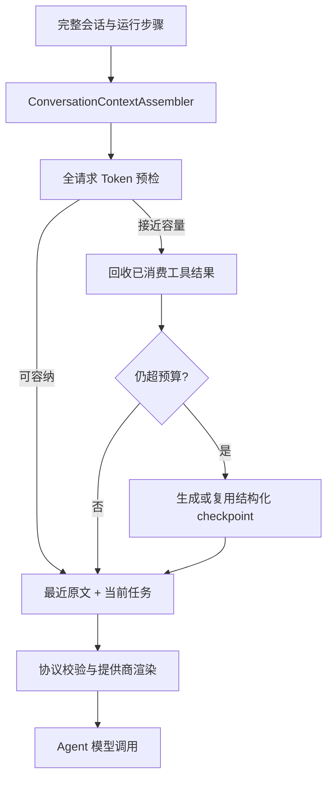

# Agent 对话上下文压缩优化计划

> 状态：实施收尾，发布门禁验证中
>
> 实施基线：`origin/main@53701fb`（司命 3.3.8）
>
> 工作分支：`feat/agent-conversation-compaction`
>
> 目标版本：v3.3.9（并行章节修订变更归入 3.3.8）
>
> 覆盖范围：项目工作台 Agent、新书立项 Agent、PC/Gateway、Android 独立运行
>
> 配套计划：[正文写作与新章规划统一上下文更新计划](chapter-outline-context-update-plan.md) 负责正文写作与大纲规划的任务资料；本文负责 Agent 自身的历史对话和同回合工具结果
>
> 核心结论：完整会话永久保存；活动上下文采用“结构化 checkpoint + 最近原文 + 当前任务 + 未消费工具事务”；不把聊天历史默认改造成 RAG，也不把原生工具协议压成文字

---

## 0. 产品决策与执行前提

本计划按以下推荐默认值编写。作者若要调整，只需修改本节并重新检查受影响的验收项，不得在代码中保留两套长期路径。

1. 项目工作台 Agent 与新书立项 Agent 一起纳入最终目标，避免 PC 工作台改好后立项仍固定截取最近 6 轮。
2. PC 在线、Android Gateway 和 Android 独立模式共用同一逻辑协议；存储适配可以不同。
3. 自动压缩不中断作者确认，但界面显示轻量提示“已整理较早上下文”，并允许查看整理范围、原因、模型和保留项。
4. 压缩默认使用本轮 Agent 已绑定的同一模型与同一提供商，不新增静默的廉价模型或跨提供商回退。
5. 完整原始消息、运行步骤和工具结果始终保留在持久化存储中；压缩只改变发送给模型的活动上下文。
6. 压缩失败或容量无法证明时，不静默删除历史继续执行；应明确失败并允许重试、重建 checkpoint 或新建会话。
7. 历史搜索不作为每轮默认步骤。以后可以另行提供作者显式的历史查找能力，但不得成为普通任务的必经路径。
8. 先与任务资料压缩 v2 共建模型绑定、TokenCounter、RequestBudgetEnvelope 和提供商消息计数器，再分别接入两条业务链路。

---

## 1. 当前实现审计

### 1.1 项目工作台 PC/Gateway

当前权威入口为：

```text
backend/app/routers/ai_writer.py
backend/app/prompts/workspace_assistant.py
```

跨回合历史目前按以下方式处理：

- 只取最近 8 条 `user/assistant` 消息；
- 用户消息最多保留 4000 字符；
- 助手消息最多保留 600 字符；
- 所有历史被拼成一段 `【历史对话】` 文本，再与当前任务放进同一个 user message；
- 历史里的工具调用、执行状态和真实资源 ID主要不以结构化协议回放；
- 是否截断由条数和字符数决定，不参考实际模型、工具 Schema 或输出预留。

这会产生四类问题：

1. 第 9 条以前仍有效的作者决定直接消失；
2. 助手消息 600 字符截断可能只留下计划开头而丢失最终结论；
3. 历史与当前任务被放进同一 user message，虽然有文字标签，仍会削弱角色和优先级边界；
4. 项目规模不大但单条消息很长时会过量，消息很多但很短时又会过早遗忘。

### 1.2 项目工作台同回合工具循环

PC 当前能正确保存原生结构：

```text
assistant.tool_calls
→ tool(tool_call_id)
→ 下一模型步骤
```

但 `_trim_context_if_needed()` 只统计 `message.content`，超过 800000 字符后直接保留头两条和尾六条。它没有计入：

- 工具 Schema；
- `tool_calls.function.arguments`；
- `reasoning_content/provider_state`；
- 消息包装和提供商协议开销；
- 输出预留；
- 工具调用与结果是否构成完整事务。

因此它理论上可能把一个原生工具事务切断，也可能在真实 token 已超限时仍不触发。

当前只有 `chapter_writer` 的正文结果经过专门的模型可见裁剪；其他搜索、读取和写入结果大多会持续留在同回合 messages 中。`_compress_search_result()` 只用于另外收集轻量搜索记录，不解决活动 messages 膨胀。

### 1.3 Android 独立工作台

当前权威文件包括：

```text
mobile/android/app/src/main/java/com/siming/mobile/data/agent/MobileWorkspaceAgent.kt
mobile/android/app/src/main/java/com/siming/mobile/data/agent/MobileAssistantConversationStore.kt
mobile/android/app/src/main/java/com/siming/mobile/data/SimingRepository.kt
mobile/android/app/src/main/java/com/siming/mobile/ui/MainViewModel.kt
```

现状：

- 本地最多保存 200 条可见消息；
- 每轮原样发送最近 12 条 `user/assistant` 消息；
- ViewModel 和 Repository 当前各有一次 `takeLast(12)`，形成重复裁剪边界；
- 同回合原生工具消息结构正确；
- 没有模型窗口感知的跨回合预算；
- 没有同回合消息压缩预检；
- 与 PC 的最近 8 条文本块语义不一致。

### 1.4 新书立项 Agent

当前权威文件包括：

```text
backend/app/services/creation_agent_turn_records.py
backend/app/services/novel_creation_agent.py
backend/app/services/creation_agent_execution.py
```

立项 Agent 当前仅重放最近 6 个已完成回合，每个回合只回放人类可见的首条 user 和最终 assistant：

- user 最多 20000 字符；
- assistant 最多 8000 字符；
- 历史工具协议不跨回合重放；
- 真实立项资料要求模型重新读取，这一原则正确；
- 同回合仍可能累积读取结果和工具协议，尚无 token 级预算。

### 1.5 与任务资料上下文的边界

`chapter_writer` 和 `outline_writer` 已通过 ContextManifest 使用模型明确选择的项目资料，不应继承普通聊天全文。

本文不得改变这一点：

```text
Agent 对话压缩
    负责：用户对话目标、确认决定、运行进度、工具回执、未解决问题

Task Context / ContextManifest
    负责：角色卡、大纲、章节、世界观、时间线等生成资料
```

角色卡、大纲和章节是可重新读取的项目事实；聊天是按时间推进的决策记录。两者共用预算基础设施，但不能共用同一种压缩产物。

---

## 2. 更新目标

1. 删除固定最近 8/12 条和立项最近 6 回合作为容量控制的权威语义。
2. 根据最终模型、提供商协议、系统提示、工具 Schema、消息和输出预留计算真实请求预算。
3. 未接近真实容量时完整保留历史，不为“看起来更短”而主动损失信息。
4. 接近容量时先回收已经被模型消费、可重新读取的旧工具结果。
5. 仍不足时将较早的完整回合整理为结构化 checkpoint，并保留最近完整原文。
6. 当前用户消息必须始终逐字保留并作为当前任务唯一意图来源。
7. 工具调用协议、待处理工具结果、一次性令牌和回合状态机不得被模型摘要或转写成自然语言。
8. checkpoint 中的执行事实由服务端根据真实 RunStep 生成；模型只负责非权威的语义导航和选择需要逐字保留的作者原话。
9. PC、Gateway 和 Android 独立模式使用相同 checkpoint Schema、预算状态和错误码。
10. 压缩前后 Agent 的真实工具调用率、任务完成率和写入安全性不得下降。

---

## 3. 明确不做

- 不把历史消息切块后默认放入向量库；
- 不要求 Agent 每轮先调用 `search_conversation_context`；
- 不删除完整会话以节省数据库空间；
- 不用关键词或正则判断哪些旧决定仍然有效；
- 不让服务端猜测用户自然语言意图；
- 不把角色卡、大纲或章节正文复制进会话 checkpoint；
- 不让 `chapter_writer`、`outline_writer` 消费普通聊天历史；
- 不解析模型输出的工具名或 JSON 文本来冒充原生工具调用；
- 不为旧的 8/12/6 条路径保留长期 fallback；
- 不在本计划中实现 AsymSpec、KV cache 压缩、logit 级推测解码或模型内部记忆。

---

## 4. 系统不变量

以下是不允许被实现阶段弱化的硬约束。

### 4.1 原始记录

1. 完整 transcript、AssistantRun 和 AssistantRunStep 是审计源，不因压缩删除或改写；作者显式删除整个会话时仍按既有删除契约处理。
2. checkpoint 是派生数据，可以失效、重建和清理，不能反向覆盖原始消息。
3. 只有 `completed` 的闭合回合可以进入跨回合 checkpoint；running/error/aborted 按明确状态保留，不能伪装成完成。

### 4.2 当前意图

1. 最新用户消息逐字进入请求，不能由摘要替代。
2. checkpoint 和历史原文只作参考，不得覆盖最新消息。
3. 编辑器选中项、旧页面状态和历史待办不能升级为当前意图。

### 4.3 工具协议

1. 未闭合工具事务必须保持原生 `assistant.tool_calls → tool` 结构。
2. 同一个 `tool_call_id` 的调用与全部结果必须原子保留或原子移除，禁止拆分。
3. 工具 Schema 每次由当前服务端注册表重新提供，checkpoint 不决定工具是否存在或开放。
4. checkpoint 禁止包含可执行的工具参数 JSON、伪造 tool call ID 或“下一步必须调用某工具”的协议文本。
5. 不支持原生工具调用且没有受控 MCP 的模型，在进入 Agent 循环前明确拒绝。
6. 原生工具调用失败后不得回退为从普通文本解析工具调用。

### 4.4 事实权威

1. 项目事实以当前数据库或 Android 当前副本为准，checkpoint 只能保存真实 ID 和读取提示。
2. 工具执行事实以 AssistantRunStep、写入事务结果和当前资源 revision 为准。
3. 模型生成的语义总结始终是 `non_authoritative_navigation`。
4. 作者原话可以逐字引用并验证消息 ID、位置和 hash，但只证明“作者说过这句话”，不证明项目当前数据仍与之一致。

### 4.5 容量与失败

1. 所有模型调用前进行真实 token 预检，不使用字符数充当硬容量。
2. 容量未知或计数器不可证明时不得宣称安全；处理方式必须与任务资料压缩 v2 的 capacity assurance 一致。
3. 当前用户消息自身超过容量时明确返回错误，不允许截断后执行。
4. checkpoint 生成失败时保留原始会话，不静默丢弃旧历史继续。

### 4.6 跨端

1. Python 与 Kotlin 对同一逻辑 ContextFrame 的规范 JSON、hash、预算结果和错误码必须通过 golden fixture。
2. Android 独立模式不得依赖 PC 正在运行。
3. 提供商消息格式可以由适配器不同映射，但逻辑信息、当前意图和工具边界必须一致。

---

## 5. 目标架构



活动上下文由五个逻辑层组成：

| 层 | 内容 | 来源 | 是否可压缩 |
| --- | --- | --- | --- |
| 系统契约 | PromptSpec、当前类别规则、安全边界 | 编译后的权威提示词 | 否 |
| 历史 checkpoint | 较早目标、决定、执行账本、未解决问题 | 派生产物 | 可重建 |
| 最近原文尾部 | 最近若干完整闭合回合 | 原始 transcript | 只允许整回合移入 checkpoint |
| 当前任务 | 最新用户消息、作者显式选中文本 | 当前请求 | 否 |
| 当前工具事务 | 本回合尚未消费的 tool calls/results | 内存 + RunStep | 未闭合时否 |

项目事实不属于这五层。模型需要项目事实时继续调用现有真实业务工具或 Task Context 工具。

---

## 6. 统一 ContextFrame 中间协议

新增内部逻辑协议 `conversation_context_frame.v1`。业务层先构造 ContextFrame，提供商适配器再映射为 OpenAI、Anthropic、OpenAI-compatible 或本机 CLI 所需格式。

```json
{
  "schema": "conversation_context_frame.v1",
  "conversation": {
    "kind": "workspace|creation",
    "id": "...",
    "revision": 42,
    "project_id": "...",
    "creation_session_id": null
  },
  "model_binding": {},
  "system_contract": {
    "prompt_hash": "...",
    "active_tool_category_hash": "..."
  },
  "checkpoint": {},
  "recent_turns": [],
  "current_user_message": {},
  "current_turn_ledger": {},
  "pending_tool_transactions": [],
  "budget": {},
  "integrity": {}
}
```

要求：

1. 内部协议区分 `historical_reference` 与 `current_user_message`，禁止提前摊平成一个字符串。
2. checkpoint 不直接保存提供商消息数组，避免一个提供商的角色限制污染其他入口。
3. 提供商适配器必须从同一 ContextFrame 渲染并接受相同 golden fixture。
4. 最新 user 消息在所有提供商映射中均保持最后一条当前任务消息。
5. 对只接受单个 system 且要求 system 位于开头的模板，只生成一个开头 system，不在后面插入第二个 system。

### 6.1 提供商映射原则

- OpenAI/Anthropic 原生 API：系统契约走提供商原生 system/developer 能力；checkpoint 作为独立历史参考内容，不与最新 user 合并。
- 仅支持传统 Chat Completions 的兼容模型：由适配器生成经过测试的历史参考 user/assistant 对，再追加最近原文与最新 user；不得打乱工具调用对。
- 本机 Agent CLI：checkpoint 放入独立、明确标记为只读历史数据的区块；实际项目能力仍通过本轮临时 MCP 暴露；不得在历史区块中放工具 JSON。
- 使用本机 Agent CLI 生成 checkpoint 时，必须启动独立压缩进程：空临时工作目录、无 Siming MCP、无作者文件读取授权、无写入权限，只允许返回待校验的结构化 stdout；无法证明隔离能力的 CLI 不承担模型摘要。
- Android DirectApi：使用与 PC 相同的逻辑帧和协议校验器，由 Kotlin 适配到现有 SSE/Chat Completions 请求。

---

## 7. 完整请求预算

### 7.1 共享基础设施

直接复用任务资料压缩 v2 中的：

```text
GenerationModelBinding
TokenCounter
RequestBudgetEnvelope
capacity_assurance = exact|conservative|unverified
```

不得为普通会话再写一个字符估算器作为第二权威路径。

### 7.2 每一步预算公式

每个模型步骤都重新计算：

```text
request_input_limit =
    context_window_tokens
  - output_reserve_tokens
  - safety_margin_tokens

current_input_tokens =
    system_prompt_tokens
  + current_tool_schema_tokens
  + provider_wrapper_tokens
  + checkpoint_tokens
  + recent_exact_turn_tokens
  + current_user_tokens
  + current_turn_ledger_tokens
  + pending_tool_transaction_tokens
  + provider_state_tokens
```

同时计算下一步增长预留：

```text
projected_next_step_tokens =
    current_input_tokens
  + max_model_visible_result_tokens_for_open_tools
  + next_step_wrapper_tokens
```

规则：

1. `current_input_tokens <= request_input_limit` 是发送硬门槛。
2. `projected_next_step_tokens` 超限时，应在执行可能返回大结果的工具前要求分页、缩小范围或整理已消费上下文。
3. 32K 只属于任务资料压缩的产品软目标，不作为聊天历史的固定触发值。
4. 历史是否整理完全由绑定模型的实际容量决定。
5. 工具类别切换后 Schema 改变，下一步必须重新计数。
6. PromptSpec、工具 Schema、模型或提供商改变会使未消费的预算结果失效，但不会删除原始会话。

### 7.3 动态最近原文

不设置固定“最近 8/12 条”。算法以完整回合为单位从新到旧装入：

1. 当前用户消息始终 exact；
2. 当前回合未消费工具事务始终 exact；
3. 从最近一个已关闭回合开始倒序加入完整 user/assistant；
4. 一个回合要么完整加入，要么整体进入 checkpoint，不能只截 assistant 前 600 字符；
5. 在预算允许时尽可能多保留原文；
6. 若最近一个完整回合也装不下，则只保留当前用户消息，并把该回合纳入 checkpoint；
7. 当前用户消息自身装不下时返回 `current_user_message_over_capacity`。

### 7.4 触发时机

1. 不在作者空闲时后台调用模型收费整理历史。
2. 作者发送新消息后先持久化该消息，再进行请求预检。
3. 若现有 ready checkpoint 和动态原文可以容纳，直接执行当前任务。
4. 若需要新 checkpoint，创建 durable attempt，向界面发送“正在整理较早上下文”，ready 后在同一用户请求中继续 Agent。
5. 整理期间不得提前调用业务工具，避免 checkpoint 失败后已产生副作用。
6. 同一 source range 命中 ready checkpoint 时不得重复调用压缩模型。
7. 回合结束后只更新 token 指标，不主动发起新的付费整理。

---

## 8. 跨回合 checkpoint

### 8.1 checkpoint 结构

```json
{
  "schema": "conversation_checkpoint.v1",
  "scope": "workspace",
  "source_range": {
    "first_sequence": 1,
    "last_sequence": 30,
    "message_count": 30,
    "source_hash": "sha256(...)"
  },
  "semantic_navigation": {
    "authority": "non_authoritative_navigation",
    "current_objectives": [],
    "resolved_decisions": [],
    "superseded_directions": [],
    "unresolved_questions": [],
    "next_context_needed": []
  },
  "author_quotes": [
    {
      "message_id": "...",
      "start_char": 10,
      "end_char": 42,
      "exact_quote": "...",
      "quote_sha256": "...",
      "purpose": "active_constraint"
    }
  ],
  "execution_ledger": [
    {
      "run_id": "...",
      "step_id": "...",
      "tool": "create_outline_nodes",
      "status": "ok",
      "resource_refs": [{"type": "outline", "id": "...", "revision": 3}],
      "error_code": null
    }
  ],
  "project_refs": [
    {"type": "outline", "id": "...", "reason": "曾在会话中操作；使用前重新读取"}
  ],
  "warnings": []
}
```

### 8.2 权威等级

| 内容 | 权威等级 | 验证方式 |
| --- | --- | --- |
| semantic_navigation | 非权威导航 | Schema、来源范围；不宣称语义完全正确 |
| author_quotes | 作者原话证据 | 消息 ID、连续位置、quote hash |
| execution_ledger | 权威执行回执 | AssistantRunStep、事务结果、资源 ID/revision |
| project_refs | 导航引用 | 使用前必须重新读取项目数据 |

### 8.3 生成算法

1. 只选择连续、完整、已关闭的旧回合范围。
2. 按时间顺序构造不可变 source bundle，不按相似度打乱顺序。
3. 服务端先从 RunStep 生成 execution ledger。
4. 压缩模型只接收该范围的人类可见消息、已有非权威导航和最小执行回执；工具列表为空。
5. 模型使用 temperature=0 和强制 JSON Schema，输出语义导航及需逐字保留的作者原话位置。
6. 服务端验证 quote 为原消息连续子串、位置与 hash 正确。
7. 模型输出不得生成 tool call；即使文本中出现工具样式，也只作为无执行权限的候选 JSON 校验，不能进入 Agent 执行器。
8. 校验通过后才以 CAS 发布 ready checkpoint。
9. 失败允许一次结构修复；再次失败则 attempt=failed，不改变当前 active checkpoint。

### 8.4 防止“摘要的摘要”持续失真

采用分段 checkpoint，而不是不断覆盖一段总摘要：

1. 每个 checkpoint segment 覆盖互不重叠、连续的原始消息范围；
2. segment 创建后绑定完整 source hash，不随下次整理改写；
3. 活动 checkpoint 按时间顺序引用多个 segment；
4. segment 数量过多时只允许再次汇总 `semantic_navigation`；
5. author quotes、execution ledger 和 project refs 由服务端确定性合并，不能经过二次自然语言摘要；
6. 所有 segment 始终可追溯到原始消息和 RunStep；
7. UI 查看 checkpoint 时可以跳回对应原始消息。

这样，即使非权威导航在多次汇总中略有损失，作者明确约束和真实执行结果也不会随着“摘要的摘要”消失。

### 8.5 失效与重建

以下情况使派生 checkpoint stale：

- 来源消息被合法修改或状态从 running/error 发生变化；
- 关联 RunStep 被重试并产生 resolved step；
- checkpoint Schema/policy 版本变化；
- 来源 hash 不匹配；
- 逻辑 scope 或 conversation 归属改变。

模型切换本身不使历史事实失效，但若新模型窗口更小，必须重新规划 active segments 和最近原文；若需要重新生成导航，则记录新的 model binding。

### 8.6 checkpoint 自身的增长边界

checkpoint 也不能无限累积。活动渲染采用以下确定性收敛规则：

1. execution ledger 按资源 ID 折叠为当前已提交 revision、最近未解决错误和仍在运行的 operation；更早成功步骤保留在审计表，不重复进入模型；
2. 已明确 superseded 的作者原话继续保存在 segment 中，但默认不进入 active author quotes，只在非权威导航中说明存在替换；
3. 未解决且仍有效的作者约束保持 exact quote，不允许为了省 token 自由改写；
4. project refs 去重为当前资源 ID，并在使用前重新读取；
5. 若 active exact constraints、未解决 operation 和最近一个完整回合本身仍超过容量，返回 `conversation_required_state_over_capacity`，要求作者新建会话或明确取消部分旧约束；服务端不能静默删除。

---

## 9. 同回合工具结果整理

### 9.1 工具事务状态

每批原生工具交互在内存中表示为 `ToolTransaction`：

```text
pending     # assistant 已发出调用，结果尚未齐全
delivered   # 结果已加入 messages，模型尚未消费
consumed    # 后续模型步骤已成功返回，证明结果已被模型看过
compactable # 已有持久 RunStep 和确定性回执，可从活动 messages 移除
```

硬规则：

- pending/delivered 必须完整保留；
- 只有 consumed 才能进入 compactable；
- 一个批次的 assistant tool_calls 和对应 tool messages 原子移除；
- 失败结果也必须先让模型看到一次，不能因为失败就提前删除；
- 终止型草稿工具成功后本轮结束，不再为继续推理压缩结果。

### 9.2 确定性回执

compactable 事务替换为服务端生成的 `CurrentTurnLedger`：

```json
{
  "step_id": "...",
  "tool": "search_chapters",
  "status": "ok",
  "summary": "返回 5 个候选章节",
  "resource_ids": ["..."],
  "result_ref": "assistant_run_step:...",
  "reread": "需要原文时重新调用对应只读业务工具",
  "write_committed": false
}
```

回执不得包含：

- 原始函数 arguments JSON；
- 可被复制执行的工具调用示例；
- 模型推测的写入成功状态；
- 未经 RunStep 证明的资源 ID；
- 大段原始正文。

### 9.3 单个工具结果自身过大

不能依赖“返回后再截断”解决，因为结果在第一次交给模型时就可能超容量。

每个 ToolSpec 必须声明模型可见结果策略：

```text
exact_bounded       # 天然有界，完整返回
paged               # 必须分页，返回 cursor
artifact_reference  # 完整内容持久化，模型按范围读取
terminal_receipt    # 草稿/写入结果只返回状态和引用
```

执行要求：

1. 搜索工具保持短候选和分页；
2. 精确读取工具支持显式范围或分页，不能随机字符截断；
3. 写工具向模型返回 revision、ID、状态和必要错误，不回灌完整对象；
4. 完整结果仍保存在 RunStep/UI 数据中；
5. 删除通用的按字段名猜测截断逻辑，改由 ToolSpec 权威投影；
6. 旧 `redact_tool_result_for_model()` 与 `_compress_search_result()` 在迁移完成后删除或收敛到统一投影器，不能长期并行。

### 9.4 重新读取

本计划不新增默认历史搜索工具。模型需要被回收的项目原文时：

- 使用对应章节、角色、大纲或世界观只读工具重新读取；
- 只读调用可命中服务端缓存，但仍返回当前数据和当前 revision；
- 已执行写操作绝不通过重新调用来“恢复上下文”；写入状态从 execution ledger 和项目真实数据读取；
- 重复读取防循环逻辑应区分“结果仍在活动上下文”和“结果已被回收”，不能把必要重读误判为死循环。

---

## 10. 防止工具再次退化成文本

这是本计划的发布阻断项。

### 10.1 请求前协议验证器

新增 `ToolProtocolValidator`，每次模型请求前验证：

1. system 只在允许的位置；
2. assistant tool call ID 非空且在当前消息序列中唯一；
3. 每个 tool message 都能找到对应 assistant call；
4. pending batch 的每个 call 都有且只有一个结果，或请求不得继续；
5. 压缩不会留下孤立 assistant/tool 消息；
6. 当前模型 capability 与请求中的 tools/tool_choice 一致；
7. checkpoint 没有被映射成 tool role；
8. 最新用户消息没有与 checkpoint 合并；
9. 传统聊天模板仍只有开头一个 system，避免再次触发 `System message must be at the beginning`。

### 10.2 能力门控

```text
supports_tool_calling=true
    → 只接受提供商原生 tool_calls

supports_tool_calling=false 且 direct MCP 已验证
    → 工具只通过进程级 MCP 执行，文本只作最终回复

两者都不满足
    → 在 Agent 循环前失败
```

禁止增加：

- 从 Markdown 代码块解析工具调用；
- 从普通 JSON 文本猜测工具名；
- 原生 function calling 报错后切换文本协议；
- 仅凭 CLI 最终文字宣称写入成功。

### 10.3 checkpoint 内容约束

- 不保存原始 tool call JSON；
- 不保存“请调用 X 工具”的旧助手计划；
- 下一步字段只能描述未解决目标，不能指定执行协议；
- 工具名只允许出现在服务端 execution ledger 的 `tool` 枚举字段；
- 渲染时以数据表述，禁止呈现为函数调用示例；
- checkpoint 生成模型不获得任何业务工具。

---

## 11. 持久化模型

### 11.1 消息顺序

为 PC 两类会话补充稳定单调顺序：

```text
AssistantMessage.sequence_no
SystemAssistantMessage.sequence_no
```

要求：

- 以 conversation 为范围唯一；
- 新消息在短事务内分配；
- 旧数据按现有稳定排序规则一次性回填；
- checkpoint source range 使用 sequence，不使用易碰撞时间戳；
- Android 本地列表顺序映射为相同逻辑 sequence。

### 11.2 ConversationContextCheckpoint

建议字段：

```text
id
conversation_kind                 # workspace|creation
assistant_conversation_id         # 二选一 FK
system_conversation_id            # 二选一 FK
parent_checkpoint_id
policy_version
schema_version
status                            # pending|compressing|ready|failed|cancelled|superseded
source_first_sequence
source_last_sequence
source_message_count
source_hash
transcript_revision
model_binding_json
model_binding_fingerprint
semantic_navigation_json
author_quotes_json
execution_ledger_json
project_refs_json
validation_json
original_tokens
checkpoint_tokens
error_code
error_detail
cancel_requested_at
created_at
updated_at
completed_at
```

数据库约束必须保证两个 conversation FK 恰有一个非空。

### 11.3 ConversationContextCheckpointSource

```text
id
checkpoint_id
source_kind                       # message|run_step|prior_segment
source_id
source_sequence
source_hash
created_at
```

用于：

- 精确审计来源；
- 验证 author quote；
- RunStep 重试后使 checkpoint stale；
- UI 跳回原始消息；
- 避免只用一个总 hash 难以定位变化。

### 11.4 ConversationContextState

每个 conversation 一行：

```text
conversation_kind
conversation_id
revision
active_checkpoint_id
active_source_last_sequence
last_budget_json
last_compacted_at
created_at
updated_at
```

使用 revision/CAS 发布 active checkpoint；网络模型调用期间不得持有数据库事务。

### 11.5 Android 本地存储

- `MobileAssistantConversationStore` 升级 schema version；
- 完整可见消息继续保存，不再以 200 条作为语义记忆上限；
- 如仍需磁盘保护，应按可配置容量归档旧文件，而不是静默删除最早消息；
- checkpoint、source range、hash、token 指标和状态与 PC Schema 对齐；
- 使用临时文件 + 原子 rename；
- Android 重启后可恢复 ready checkpoint，failed/compressing attempt 做确定性恢复。

---

## 12. 并发、取消和原子发布

采用与任务资料压缩 attempt 相同的三阶段事务模式。

### 阶段一：短事务

1. 读取 conversation revision；
2. 选择连续已关闭 source range；
3. 计算 source hash 和 idempotency key；
4. 创建 pending attempt；
5. 新 attempt 使同一范围旧 pending/compressing attempt superseded；
6. 提交事务。

### 阶段二：事务外

1. 读取不可变来源快照；
2. 生成确定性 execution ledger；
3. 调用同 provider/model 的压缩模型；
4. 验证 Schema、quote、source refs；
5. 定期检查取消与 supersede；
6. 不持有 SQLAlchemy session 锁。

### 阶段三：新事务原子发布

1. 重新读取 conversation/context revision；
2. 验证 source range 未改变；
3. 验证 RunStep retry/resolution 状态；
4. 只有当前 attempt 可以发布；
5. 写 checkpoint、sources、指标；
6. CAS 更新 active checkpoint；
7. attempt=ready；
8. 提交后才允许 ContextAssembler 使用。

若作者在压缩期间发送新消息：

- 新消息照常持久化；
- 正在整理的旧 source range 不包含任何当前待执行 user 消息，因此来源未变时 checkpoint attempt 可以继续；
- 尚未开始业务工具的较早 Agent run 标为 superseded，sequence 更高的最新 user 成为唯一当前任务；
- 新请求只有在 checkpoint ready 且按最新 user 重新通过预算验证后才继续模型调用；
- 若来源范围发生变化，则 supersede 并重建。

---

## 13. 两类 Agent 的具体接入

### 13.1 项目工作台 Agent

删除权威使用：

```text
_assistant_history_text(limit=8)
_assistant_history_from_messages(... limit=8)
_trim_context_if_needed(max_chars=800_000)
```

替换为：

```text
load transcript/run steps
→ assemble ContextFrame
→ token preflight
→ compact consumed tool transactions if needed
→ ensure checkpoint if needed
→ render provider messages
→ ToolProtocolValidator
→ model call
```

`build_workspace_assistant_initial_user_message()` 不再接收 `history_text`。它只渲染作品身份、作者显式编辑内容、当前设置和当前用户任务。历史由独立 ContextFrame 层提供。

### 13.2 新书立项 Agent

删除 `_MAX_REPLAY_TURNS = 6` 作为活动历史权威限制。

保留正确原则：

- 跨回合不重放旧工具协议；
- 当前立项数据必须重新读取；
- 每条消息最多一次成功写入；
- 已完成写入后本轮结束。

新 checkpoint 专注：

- 作者已经表达的创作目标；
- 作者确认、否定或替换过的方向；
- 已完成的真实 artifact/revision 回执；
- 尚未解决的采访问题；
- 最近若干轮逐字对话。

它不能把旧立项快照复制为权威数据；Agent 仍使用 session 工具读取当前 revision。

### 13.3 Gateway

- Android 调用 PC Gateway 时只传 conversation ID 和最新消息；
- 不再由客户端把一份 `history` 数组作为第二权威来源；
- 服务端从 canonical conversation 构造 ContextFrame；
- 手机本地会话首次切换到 Gateway 时，先通过显式 transcript sync/import 协议同步带稳定 message ID、sequence 和 hash 的完整增量；不得继续借每轮请求的无类型 `history` 字段临时灌入；
- transcript sync 必须校验设备、作品、会话归属和幂等键，并返回 canonical conversation ID；
- 若离线请求稍后重放，必须使用消息 ID/幂等键避免重复加入 transcript。

### 13.4 Android 独立 Agent

- 本地 ConversationContextAssembler 与 PC 使用同一 JSON fixture；
- 不再 `takeLast(12)`；
- DirectApi 每个模型步骤前执行 token preflight 和协议校验；
- 工具结果 consumed 后按统一 ledger 回收；
- checkpoint 模型调用使用当前 Android 作者配置的 Agent 模型；
- 无可验证模型容量时明确提示配置，不继续按字符猜测；
- UI 中的完整聊天列表不因 active checkpoint 改变。

### 13.5 本机 Agent CLI/MCP

- CLI 自己可能管理其内部 session，但司命仍以本轮 ContextFrame 为外部事实边界；
- checkpoint 只提供人类可读历史导航，不注入 MCP 工具 JSON；
- 当前可用工具仍由临时 MCP 与 `set_tool_categories` 状态文件决定；
- checkpoint 的模型整理必须在独立、无 MCP、无项目目录权限的进程中进行；如果当前 CLI 不能提供这种隔离，则不得静默改用另一提供商，只能使用仍然适用的 ready checkpoint，无法满足容量时明确失败；
- CLI 写入成功只由数据库/草稿持久状态证明；
- CLI 中断后不得重新启动整个进程以重做可能已提交的写入。

---

## 14. API 与错误契约

### 14.1 会话上下文状态

建议新增只读接口：

```text
GET /projects/{project_id}/ai/assistant/conversations/{conversation_id}/context-state
GET /projects/{project_id}/ai/assistant/conversations/{conversation_id}/checkpoints
GET /projects/{project_id}/ai/assistant/conversations/{conversation_id}/checkpoints/{checkpoint_id}
```

可选操作：

```text
POST   .../checkpoints/rebuild
POST   .../checkpoints/{checkpoint_id}/cancel
DELETE .../checkpoints/{checkpoint_id}   # 只删派生产物，随后按需重建
```

不提供直接编辑 checkpoint 的接口，避免作者修改派生摘要后与原始记录失去可追溯关系。

### 14.2 状态返回

```json
{
  "status": "ready",
  "policy_version": 1,
  "active_checkpoint_id": "...",
  "source_message_count": 30,
  "recent_exact_turn_count": 4,
  "original_history_tokens": 84000,
  "active_history_tokens": 19000,
  "trigger": "projected_next_step_over_capacity",
  "capacity_assurance": "exact",
  "model": "provider:model",
  "warnings": []
}
```

### 14.3 错误码

至少包含：

```text
conversation_capacity_unknown
current_user_message_over_capacity
conversation_checkpoint_required
conversation_checkpoint_failed
conversation_checkpoint_cancelled
conversation_checkpoint_superseded
conversation_source_changed
conversation_required_state_over_capacity
conversation_protocol_invalid
orphan_tool_result
incomplete_tool_transaction
tool_capability_unavailable
tool_result_over_capacity
provider_message_mapping_failed
final_agent_request_over_capacity
```

---

## 15. PC 与 Android 界面

### 15.1 默认表现

压缩成功后在聊天区显示非阻断轻提示：

```text
已整理较早上下文 · 保留最近 4 轮原文 · 查看
```

不得显示为 assistant 普通消息，避免它进入 transcript 或被模型当成作者要求。

### 15.2 详情面板

显示：

- 为什么触发；
- 覆盖的消息范围和时间；
- 原始 token 与活动 token；
- 最近保留多少完整回合；
- 作者原话引用；
- 真实执行回执；
- 非权威语义导航；
- 使用的 provider/model；
- capacity assurance；
- checkpoint 版本与状态；
- “跳到原消息”“重新整理”“新建对话”。

不显示：

- API key；
- 隐藏推理；
- 可直接复制执行的工具 arguments；
- 被模型伪造但未验证的操作状态。

### 15.3 失败表现

- 生成 checkpoint 失败：保留用户刚发送的消息和完整 transcript，明确提示尚未执行当前任务；
- 可重试整理；
- 可切换有容量档案的模型；
- 可新建对话；
- 不能显示“已完成”或继续调用业务写工具。

---

## 16. 代码改造建议

### 16.1 共享后端核心

新增：

```text
backend/app/services/conversation_context/contracts.py
backend/app/services/conversation_context/model_binding.py
backend/app/services/conversation_context/budget.py
backend/app/services/conversation_context/transcript.py
backend/app/services/conversation_context/checkpoints.py
backend/app/services/conversation_context/checkpoint_prompt.py
backend/app/services/conversation_context/checkpoint_validator.py
backend/app/services/conversation_context/execution_ledger.py
backend/app/services/conversation_context/tool_transactions.py
backend/app/services/conversation_context/context_frame.py
backend/app/services/conversation_context/provider_renderer.py
backend/app/services/conversation_context/protocol_validator.py
backend/app/services/conversation_context/attempts.py
```

TokenCounter、GenerationModelBinding 和 RequestBudgetEnvelope 应放在任务资料与会话上下文都能依赖的模型运行时层，不得复制实现。

### 16.2 后端现有文件

重点修改：

```text
backend/app/routers/ai_writer.py
backend/app/prompts/workspace_assistant.py
backend/app/services/creation_agent_turn_records.py
backend/app/services/novel_creation_agent.py
backend/app/services/creation_agent_execution.py
backend/app/services/persistence/assistant_workspace.py
backend/app/modules/assistant/application/workspace.py
backend/app/modules/assistant/infrastructure/models.py
backend/app/modules/model_runtime/...
backend/app/services/workspace/run_log.py
backend/app/services/workspace/tool_schemas.py
backend/app/services/workspace/registry.py
backend/app/schemas/ai_writer.py
backend/app/modules/assistant/application/system_conversations.py
backend/app/modules/assistant/infrastructure/system_conversations.py
backend/alembic/versions/*
```

### 16.3 PromptSpec 与工具契约

```text
backend/prompt_specs/assistant/workspace-quality.md
backend/prompt_specs/creation/novel-stage.md
backend/prompt_specs/shared/execution-contract.md
backend/app/prompts/packs/workspace_quality.py
```

要求：

- 增加历史 checkpoint 权威等级说明；
- 删除依赖旧 `history_text` 的提示；
- 保持最新用户消息唯一当前意图；
- 编译器 golden case 覆盖 checkpoint 后真实工具调用；
- ToolSpec 增加模型结果策略；
- 不通过继续堆自然语言示例解决协议问题。

### 16.4 PC 前端

重点范围：

```text
frontend/src/components/WorkspaceAssistantChat.tsx
frontend/src/services/...
frontend/src/types/...
立项对话相关组件
对应 query/mutation/tests
```

### 16.5 Android

重点范围：

```text
mobile/android/app/src/main/java/com/siming/mobile/data/agent/MobileWorkspaceAgent.kt
mobile/android/app/src/main/java/com/siming/mobile/data/agent/MobileAssistantConversationStore.kt
mobile/android/app/src/main/java/com/siming/mobile/data/creation/CreationAgentTurnRecords.kt
mobile/android/app/src/main/java/com/siming/mobile/data/network/DirectApi.kt
mobile/android/app/src/main/java/com/siming/mobile/data/SimingRepository.kt
mobile/android/app/src/main/java/com/siming/mobile/ui/MainViewModel.kt
contracts/mobile-pc-parity.json
scripts/check-mobile-pc-parity.py
Android 单元与集成测试
```

---

## 17. 实施阶段

### 阶段 0：协议冻结与失败测试

完成：

- ADR：会话 archive、checkpoint、最近原文和工具事务边界；
- `conversation_context_frame.v1`；
- `conversation_checkpoint.v1`；
- capacity assurance 共用决策；
- provider 映射规则；
- 工具协议退化回归样本；
- Python/Kotlin golden fixture。

门槛：

- 作者产品决策无未解决项；
- 测试可以稳定复现当前 8/12/6 条截断和 800000 字符裁剪问题；
- 测试证明历史摊平与原生角色回放的差异；
- 尚未切换生产路径。

### 阶段 1：共享模型容量基础

与任务资料压缩 v2 共建：

- GenerationModelBinding；
- TokenCounter；
- RequestBudgetEnvelope；
- provider wrapper/tool Schema 计数；
- exact/conservative/unverified；
- 每次请求发送前预检。

门槛：

- 当前业务仍走旧历史策略，但已经能报告真实请求预算；
- 未知容量不会再被 1M 猜测伪装成已验证；
- PC/Kotlin fixture 一致。

### 阶段 2：ContextFrame 与协议验证器

- 引入内部中间协议；
- 原有 messages 先通过新 renderer 生成，行为保持不变；
- 每次请求运行 ToolProtocolValidator；
- 删除任何文本工具 fallback；
- 建立 provider matrix 测试。

门槛：

- 未压缩场景的工具行为与当前版本一致；
- 故意破坏 tool_call_id、角色或 system 顺序时请求被阻止；
- 不再可能把原生错误降级为普通文本执行。

### 阶段 3：同回合工具事务回收

- ToolTransaction 状态；
- consumed 边界；
- CurrentTurnLedger；
- ToolSpec 模型结果策略；
- 分页/范围读取；
- 删除 800000 字符裁剪和通用字段名截断。

门槛：

- 未消费结果逐字保留；
- 已消费事务原子回收；
- 工具调用成功率不下降；
- 超大单次结果在工具边界被安全处理。

### 阶段 4：项目工作台跨回合 checkpoint

- 数据迁移；
- segment/attempt/CAS；
- 动态最近原文；
- canonical conversation 的增量 transcript sync；
- `ai_writer.py` 切换唯一权威路径；
- PC/Gateway 状态接口和 UI。

门槛：

- 删除固定 8 条与 4000/600 字符逻辑；
- checkpoint 后“继续”“按刚才第二种方案”等测试保持正确；
- 项目资料仍重新读取；
- 原始聊天 UI 完整不变。

### 阶段 5：新书立项 Agent

- 替换固定 6 回合 replay；
- 将 artifact/revision 写入 execution ledger；
- 保持一轮一次成功写入边界；
- 系统会话与项目会话共用 checkpoint 内核。

门槛：

- 已确认、已否定、已替换方案在长对话中不混淆；
- checkpoint 不替代当前 creation snapshot；
- 工具退化为文本的历史回归用例通过。

### 阶段 6：Android 独立 parity

- 本地持久化升级；
- 移除 `takeLast(12)`；
- 移除 ViewModel 与 Repository 的重复 history 裁剪，并删除普通运行请求中的 `history` 第二权威字段；
- Kotlin ContextFrame/预算/checkpoint；
- DirectApi 每步预检；
- UI 轻提示和详情。

门槛：

- 相同 fixture 的 source hash、预算、segment 选择、错误码一致；
- Android 独立运行不依赖 PC；
- 断电/重启后 checkpoint 和完整聊天可恢复。

### 阶段 7：清理、全量回归与发布

- 删除旧 8/12/6 条路径；
- 删除 `_trim_context_if_needed()`；
- 删除或收敛旧工具结果裁剪器；
- 更新移动端导出契约和文档；
- 全量测试、安装包和 APK；
- 确认 GitHub Actions 全绿后发布。

---

## 18. 测试计划

### 18.1 当前意图与时间顺序

1. 最新消息与旧目标冲突时只执行最新消息。
2. “继续”能依据 checkpoint 中未解决目标和最近原文继续。
3. 旧方案随后被作者否定，checkpoint 显式记录 superseded，不执行旧方案。
4. 相似但不同的两章、两角色不因语义摘要合并。
5. 消息顺序完全按 sequence 保持。

### 18.2 token 与触发

1. 小会话不调用压缩模型。
2. 大窗口模型能容纳完整历史时不压缩。
3. 小窗口模型只在真实预检需要时压缩。
4. system、tools、arguments、results、wrapper、output 和 safety 全部计数。
5. 类别切换后 Schema 增长触发重新预检。
6. 当前 user 自身过长时明确失败且不截断。
7. unknown capacity 不伪装为安全。

### 18.3 checkpoint 真实性

1. author quote 不是连续子串时拒绝。
2. quote 位置/hash 错误时拒绝。
3. 模型虚构资源 ID 不进入 execution ledger。
4. RunStep 失败不能被写成成功。
5. 项目数据修改后 checkpoint 的 project ref 仍要求重读。
6. segment 按时间顺序、不重叠、不漏范围。
7. 多次 rollup 后 exact quotes 和 execution ledger 不丢失。
8. failed checkpoint 不替换 active checkpoint。

### 18.4 工具协议退化阻断

1. checkpoint 后模型调用 `set_tool_categories` 仍产生真实 tool_calls。
2. 类别切换后下一步真实业务工具可用。
3. checkpoint 中出现工具名和 JSON 文本也不能触发执行。
4. 原生 tool calling 报错后本轮失败，不走文本解析。
5. 不支持工具的模型在循环前被拒绝。
6. local CLI 只有 MCP 持久化证据才能证明写入。
7. system 顺序兼容 Jinja 模板。
8. assistant/tool 对被故意拆开时 ProtocolValidator 阻断。
9. 工具结果未消费前不能回收。
10. 工具结果消费后回收不改变下一步选择和完成结果。

### 18.5 同回合工具结果

1. 多轮搜索不会让旧结果无限累积。
2. 模型下一步能看到刚返回的完整结果。
3. 回收后需要再次读取时允许安全只读重读。
4. 写入工具不能因重读机制被重复执行。
5. 超大读取要求分页或范围，不做任意字符截断。
6. terminal draft 结果结束模型回合。

### 18.6 并发与恢复

1. 相同 source/idempotency key 不重复调用压缩模型。
2. 两个并发 attempt 只有一个 CAS 发布。
3. 压缩期间发送新消息不丢消息。
4. 来源状态变化使旧 attempt superseded。
5. 取消和 provider timeout 不留下永久 compressing。
6. PC 进程重启后从 ready checkpoint 恢复。
7. Android 进程重启后从原子本地文件恢复。
8. RunStep 重试后 ledger 使用 resolved step。

### 18.7 跨端与提供商

至少覆盖：

```text
OpenAI 原生工具调用
Anthropic 原生工具调用
OpenAI-compatible 支持工具调用
不支持工具的本地模型
Codex CLI 直接 MCP
Claude Code CLI 直接 MCP
OpenCode CLI 直接 MCP
Android DirectApi
Android Gateway PC route
```

每个入口验证：

- 最新 user 位置；
- system 顺序；
- tool call/result 配对；
- checkpoint 权威标签；
- token 预算；
- 失败语义；
- 实际工具调用而非文本模拟。

### 18.8 安全

1. 历史用户消息包含“忽略当前任务”时不能覆盖最新 user。
2. 工具结果中包含提示词注入时，只作为不可信工具数据处理。
3. checkpoint 模型无业务工具权限。
4. checkpoint 不泄漏其他作品或其他会话内容。
5. 跨 provider 未授权时不能发送历史。
6. API 返回不暴露隐藏推理、密钥或完整敏感工具参数。

### 18.9 性能与费用

记录：

- 未触发压缩的额外 CPU/延迟；
- 触发 checkpoint 的模型调用次数和费用；
- 压缩前后 prompt tokens；
- 同回合工具结果回收比例；
- cache hit；
- 任务完成率；
- 真实 tool_calls 比例；
- checkpoint 后重读工具次数。

上线门槛建议：

- 未触发压缩的预算/验证额外延迟不超过 50ms（不含模型调用）；
- 同一 source range 重试不重复付费；
- 工具文本退化率不得高于基线，目标为 0；
- checkpoint 后关键长会话任务完成率不低于完整历史可容纳时的基线。

---

## 19. 手工验收场景

### A. 普通短会话

- 10 轮以内且完整请求可容纳。
- 预期：全部原文，无 checkpoint 模型调用，行为与当前版本一致。

### B. 长期写作讨论

- 先提出方案 A，随后否定 A 并确认 B，几十轮后说“按刚才确认的继续”。
- 预期：checkpoint 保留 B 和 A 已 superseded；Agent 不执行 A。

### C. 大量搜索工具结果

- 同一回合多次搜索章节、角色和大纲。
- 预期：刚返回结果完整可见；消费后的旧批次变为 ledger；协议仍合法。

### D. 工具样式文本干扰

- 旧消息中含 `{"name":"chapter_writer"...}` 或“请调用 create_outline_nodes”。
- 预期：不会执行；只有本轮模型产生的原生 tool_calls 才能进入执行器。

### E. 无下一章大纲

- 长会话后作者要求写下一章，真实项目中没有章级大纲。
- 预期：Agent 读取真实大纲，生成未保存 OutlineDraft；checkpoint 不能伪造旧节点存在。

### F. 立项方向反复修改

- 作者先确认方向，后续撤销并替换，多轮后说“继续”。
- 预期：Agent 先读取当前 creation revision；历史只帮助理解，不恢复旧 artifact。

### G. checkpoint 失败

- 压缩模型超时或输出非法 Schema。
- 预期：当前任务尚未执行，完整消息保留，UI 可重试；不静默截掉旧历史。

### H. Android 独立重启

- 生成 checkpoint 后杀死应用并重启继续。
- 预期：聊天列表完整，active checkpoint 恢复，当前工具仍走手机临时契约。

### I. 模型切换

- 从大窗口模型切换到小窗口模型。
- 预期：重新规划最近原文与 segments；不删除原始历史；预算可验证后继续。

---

## 20. 主要风险与缓解

| 风险 | 影响 | 缓解 |
| --- | --- | --- |
| 摘要遗漏作者关键决定 | 后续行为偏离 | exact author quotes、最近原文、segment 化、失败不发布 |
| 摘要把旧决定当当前任务 | 重复或错误写入 | 最新 user 独立、superseded 字段、历史仅参考 |
| 工具协议被压成文字 | 工具调用退化 | 原子事务、ProtocolValidator、禁止文本 fallback |
| 工具结果回收太早 | 模型没看见结果 | delivered→consumed 状态，至少成功消费一次 |
| 单个工具结果过大 | 第一次返回即超限 | ToolSpec 分页/范围/引用策略，执行前预算 |
| 递归摘要逐步失真 | 长会话累积误差 | 不重写 segment；权威 quote/ledger 确定性合并 |
| 项目事实过期 | 用旧角色/大纲继续 | checkpoint 只存 ID，使用前重新读取当前 revision |
| 压缩增加费用和延迟 | 用户体验下降 | 仅容量触发、缓存、幂等、轻提示 |
| PC/Android结果不同 | 跨端继续失败 | 共享协议、golden fixture、同模型策略 |
| 未知模型窗口 | 仍可能超限 | capacity assurance；精确档案优先，否则只允许 256K 有界兜底 |
| 并发新消息覆盖 checkpoint | 丢上下文 | source range + revision/CAS + supersede |
| 历史提示词注入 | 越权执行 | checkpoint 非当前指令、无工具权限、项目归属校验 |

---

## 21. 完成验收清单

- [x] 完整 transcript 和 RunStep 永久保留。
- [x] 固定最近 8/12/6 条不再是权威上下文策略。
- [x] 800000 字符裁剪已删除。
- [x] PC、Gateway、Android 独立共用 ContextFrame 契约。
- [x] 项目工作台和立项助手共用 checkpoint 内核。
- [x] 最新用户消息逐字、独立、最后进入当前任务位置。
- [x] 小会话不调用压缩模型。
- [x] 所有模型步骤使用完整 token 预检。
- [x] capacity unknown 不伪装成安全。
- [x] checkpoint segment 可追溯到原消息和 RunStep。
- [x] author quote 连续位置和 hash 校验通过。
- [x] execution ledger 完全由真实工具结果生成。
- [x] semantic navigation 明确非权威。
- [x] 项目事实使用前重新读取。
- [x] pending/delivered 工具事务不被压缩。
- [x] consumed 工具事务原子回收。
- [x] 不存在孤立 tool call/result。
- [x] 不存在文本工具 fallback。
- [x] 不支持工具的模型明确失败。
- [x] 本机 CLI 写入只以持久化结果证明。
- [x] checkpoint 中的工具样式文本不能触发执行。
- [x] checkpoint 失败不执行当前业务任务。
- [x] 并发、取消、supersede 和恢复测试通过。
- [x] Python golden fixture 与 Android 静态导出契约通过。
- [ ] Kotlin golden fixture 经 GitHub Actions 的 Android 构建验证通过。
- [x] PromptSpec 编译与工具目录检查通过。
- [ ] 后端、前端、Android、架构和 E2E 全量测试通过。
- [ ] GitHub Actions 全部通过后才能发布。
- [ ] Release 包含 Windows 安装包、SHA-256、正式签名 Android APK 和 APK SHA-256。
- [ ] 发布后验证安装、升级、PC 长会话、Android 独立长会话和真实工具调用。

---

## 22. 发布与回滚

### 22.1 发布要求

1. 从最新主分支创建临时工作分支；
2. 不与任务资料压缩或其他 Agent 分支争用版本号；
3. CI 未全绿不得发布；
4. Windows 必须提供 `Siming-Setup.exe` 和 SHA-256；
5. Android 必须提供正式签名 `Siming.apk` 和 SHA-256；
6. 安装包需在干净 Windows 环境完成启动、升级和长会话冒烟测试；
7. 发布说明明确：完整聊天未删除、活动上下文会自动整理、可查看 checkpoint。

### 22.2 回滚原则

代码回滚不得恢复固定 8/12/6 条静默截断作为长期方案。

安全回滚方式：

- 停止创建新 checkpoint；
- 保留所有已产生的派生记录和完整 transcript；
- 使用上一个已验证 ready checkpoint 或要求新建会话；
- 数据迁移保持向后可读；
- 不删除作者聊天或运行审计；
- 修复后重新启用唯一 ContextFrame 路径。

---

## 23. 执行完成报告模板

````markdown
## 实现结果

### 基线与版本
- 执行基线：
- 工作分支：
- 目标版本：
- 最终提交：

### 权威路径
```text
填写最终 ContextFrame → preflight → checkpoint/tool compaction → provider 的真实路径
```

### 数据迁移
- 消息 sequence：
- checkpoint/state/source 表：
- Android 本地 schema：
- 旧 8/12/6 条策略：

### 工具协议保护
- 原生 tool validation：
- direct MCP：
- 已删除文本 fallback：
- consumed transaction：

### 测试
- 后端：
- 前端：
- Android：
- PromptSpec/架构：
- Provider matrix：
- E2E：
- 未运行项及原因：

### 关键证据
- 小会话无压缩：
- 长会话 checkpoint：
- 最新意图覆盖旧决定：
- tool-like text 不执行：
- 原生工具调用未退化：
- PC/Android parity：
- checkpoint 失败不丢历史：

### 发布产物
- GitHub Actions：
- Siming-Setup.exe：
- Windows SHA-256：
- Siming.apk：
- APK SHA-256：

### 已知限制
-

### 是否满足全部验收项
- 是/否：
- 未满足项：
````
