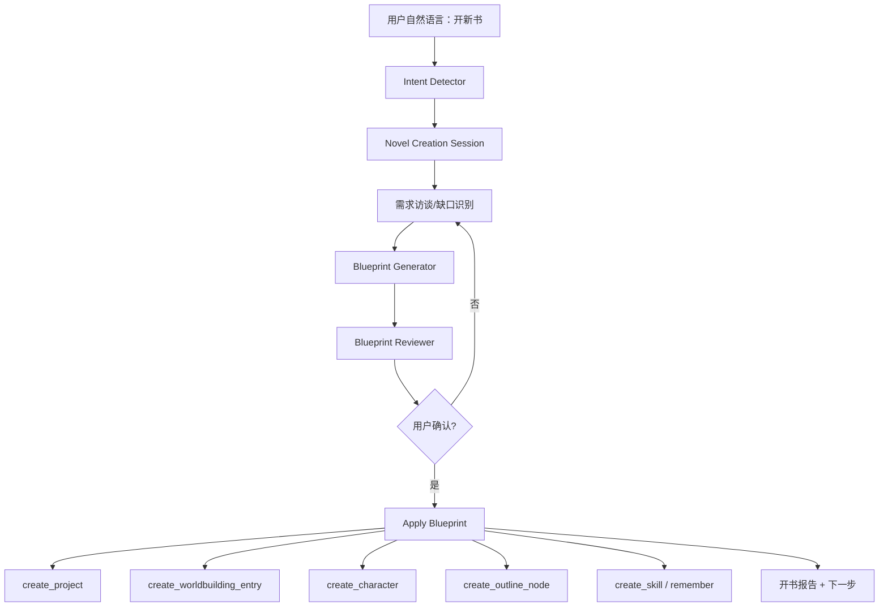

# 墨枢新小说创建 Agent 能力任务书

> 目标：让项目助手和外部 Agent 在用户“从 0 创建新小说”时，不再只是调用 `create_project` 建一条空作品记录，而是能完成“需求访谈 → 创意方案 → 世界观/角色/大纲/风格/禁用规则 → 首批可写章节 → 后续写作工作流”的完整开书流程。
>
> 严肃编程执行任务板见：`docs/agent/novel-project-creation-task-board.md`。本文负责说明产品目标和能力设计；任务板负责多人分工、文件边界、验收命令和完成记录。

## 0. 现状判断

### 0.1 外部 Agent 现在能不能看到系统里的提示词？

目前不能完整看到。

外部 Agent 通过 MCP 调用墨枢时，能看到的是：

- `tools/list` 返回的工具名、描述、参数 schema。
- 工具调用后的结果，例如 `chapter_writer` 产出的草稿、`evaluate_chapter` 的评分结果、`context_snapshot` 等。
- 如果开启了 `project_management` 权限包，可以调用作品、技能、定时任务、导入导出等管理工具。

外部 Agent 默认看不到的是：

- `backend/app/prompts/packs/chapter_quality.py` 等内部 PromptPack 的完整 system prompt。
- `evaluate_chapter` 的完整评分 prompt。
- `chapter_writer` 内部如何拼接写作技巧、去 AI 味规则、章节钩子规则。
- 项目助手质量模式/快速模式的完整总控提示词。

这是一种相对安全的设计：外部 Agent 调用“能力”，不直接复制内部提示词。但为了让 Claude Code / Codex 能更聪明地协作，需要新增“提示词能力说明/方法卡片”工具，让它知道某个工具适合做什么、输入应该怎么组织、输出如何验收，而不是把完整系统提示词裸露出去。

### 0.2 参考项目要借鉴什么

参考项目：

- `D:\AI\awesome-novel-skill`
- `D:\AI\oh-story-claudecode`

可借鉴工作流和能力结构、提示词。

可借鉴点：

- `awesome-novel-skill`：入口检测、初始化、状态机、总调度 agent、子 agent 分工、提示词组装、归档更新。
- `awesome-novel-skill` 的 `prompt-crafter`：把章纲、记忆、反 AI 规则组装成分层提示词，并有自检。
- `oh-story-claudecode` 的 `story-long-write`：开书 Phase 1-5，从选题、核心设定、大纲、正文、质检推进。
- `story-architect`：题材核心梗、世界观、大纲、开篇、钩子、反转、情绪弧线。
- `character-designer`：角色档案、语言风格、动机链、人物弧线、关系。
- `narrative-writer`：正文写作、去 AI 味 Gate、字数达标、禁止总结感悟、禁止模板句。
- `quality-checklist`：章节结构、开篇、推进、信息传递、场景、章尾、语言、连载连续性。

## 1. 产品目标

### 1.1 用户故事

用户可以对项目助手或外部 Agent 说：

- “帮我开一本仙侠小说。”
- “我想写一个女主修仙，但世界观有病毒和黄泉设定，帮我搭一本书。”
- “创建一个适合写同人的项目，先给我三个方向。”
- “我要写番茄风格的长篇爽文，先把世界观、角色、大纲搭好。”

系统应该能够：

1. 识别这是“新小说创建”意图。
2. 通过少量问题收集关键需求。
3. 生成 1-3 个可选方案。
4. 用户确认后创建作品。
5. 自动初始化：
   - 项目基础信息
   - 写作风格
   - 禁用句式/修辞限制
   - 世界观骨架
   - 核心角色
   - 角色关系
   - 第一卷/前 10 章大纲
   - 黄金三章方向
   - 项目级技能和记忆
6. 展示所有即将写入的信息，允许用户编辑。
7. 写入后生成“开书报告”和“下一步建议”。
8. 外部 Agent 也可以通过 MCP 完成同样流程，并在前端运行过程里实时显示。

### 1.2 非目标

- 不要求一次生成全书所有章节大纲。
- 不要求联网抓取平台榜单作为默认流程，除非用户明确要求“参考热门趋势/上网找资料”。
- 不暴露 API Key、模型密钥、完整内部系统提示词。
- 不直接复制参考项目的提示词文本进入墨枢，应提炼为方法卡片和工作流规则。

## 2. 总体架构



核心设计原则：

- **先草案，后写入**：所有世界观、角色、大纲先生成候选，用户确认或自动模式确认后再写入。
- **方法卡片可检索**：写作技巧、评分标准、开书流程转成 MethodCard/RAG 内容，供内外部 Agent 查询。
- **Prompt 不裸奔**：外部 Agent 不直接读取完整 system prompt，只读取“工具使用说明”和“方法摘要”。
- **单一工具源**：新增工具必须注册到 `ToolRegistry`，内部助手、定时任务、MCP、前端工具目录同源。
- **可观测**：每一步都要有运行事件，前端能看到正在问什么、生成什么、写入什么。

## 3. 数据模型任务

### TASK-NOVEL-001：新增 NovelCreationSession

负责人：后端 A

目标：记录一次开书流程，支持暂停、恢复、用户修改和外部 Agent 接续。

建议模型：

- `NovelCreationSession`
  - `id`
  - `source_project_id` nullable：如果从已有项目衍生/同人，可指向来源作品
  - `created_project_id` nullable：确认写入后生成的新作品
  - `status`: `collecting | drafted | reviewing | applying | completed | failed | cancelled`
  - `mode`: `auto | manual`
  - `user_brief`
  - `target_audience`
  - `genre`
  - `platform`
  - `blueprint_json`
  - `review_json`
  - `created_at`
  - `updated_at`

验收：

- 运行时 schema 自动补表。
- 单测覆盖创建、更新状态、恢复 session。
- 旧数据不受影响。

### TASK-NOVEL-002：新增 MethodCard / PromptPlaybook

负责人：后端 A

目标：把写小说方法论、工具使用说明、评分维度变成可查询资料。

建议模型：

- `MethodCard`
  - `id`
  - `category`: `project_setup | premise | genre | worldbuilding | character | outline | opening | chapter | anti_ai | review | tool_usage`
  - `title`
  - `summary`
  - `content`
  - `source_note`
  - `tags_json`
  - `enabled`
  - `is_builtin`

内置初始卡片：

- 开书流程：需求访谈、方案草案、确认、写入。
- 题材定位：核心梗、目标情绪、读者期待。
- 世界观骨架：规则、代价、边界、冲突资源。
- 角色设计：目标、动机链、弱点、语言风格、关系网。
- 大纲设计：卷纲、前 10 章、黄金三章、章尾钩子。
- 正文质量：开篇、推进、信息传递、场景、章尾、语言。
- 去 AI 味：禁用词、句式、心理外化、对话差异、结尾克制。
- 工具使用：`chapter_writer`、`evaluate_chapter`、`create_project` 等工具的输入建议。

验收：

- MethodCard 纳入 RAG 索引。
- 提供初始化脚本或 runtime seed。
- 不直接复制参考项目长段原文，所有卡片是墨枢自己的摘要/规则。

## 4. 工具任务

### TASK-NOVEL-010：新增 `list_creation_methods`

负责人：后端 B

用途：让项目助手和外部 Agent 了解开新书时有哪些方法卡片、流程和工具规则。

输入：

- `category?`
- `query?`
- `limit?`

输出：

- 方法卡片摘要列表。
- 每条包含 `id/title/category/summary/tags`。

权限：

- `tool_type="read"`
- MCP pack: `readonly_collaboration`

验收：

- 外部 Agent 在 readonly 模式也能查询。
- 返回内容不包含完整内部 system prompt。

### TASK-NOVEL-011：新增 `get_tool_playbook`

负责人：后端 B

用途：回答“这个工具怎么用”“创建小说时应该怎么调用工具”。

输入：

- `tool_name`
- `scenario?`: `new_project | chapter_writing | review | cataloging | export`

输出：

- 工具用途。
- 推荐前置工具。
- 推荐参数组织方式。
- 输出如何使用。
- 常见错误。
- 是否写入数据库。
- 是否需要用户确认。

验收：

- `chapter_writer` 返回应说明：它内部会使用写作提示词，但外部 Agent 只需要提供大纲、角色、需求、模式。
- `evaluate_chapter` 返回应说明评分维度摘要，不泄露完整评分 prompt。
- MCP tools/list 中可见。

### TASK-NOVEL-012：新增 `draft_novel_blueprint`

负责人：后端 B

用途：根据用户需求生成开书蓝图，不写数据库。

输入：

- `brief`
- `genre?`
- `platform?`
- `target_audience?`
- `tone?`
- `reference_project_id?`
- `variant_count?` 默认 2，上限 3
- `use_methods?` 默认 true

输出结构：

- `blueprints[]`
  - `title`
  - `logline`
  - `selling_points`
  - `target_reader`
  - `genre_positioning`
  - `worldbuilding_seed`
  - `main_characters`
  - `core_conflict`
  - `volume_outline`
  - `first_10_chapter_outline`
  - `golden_three`
  - `style_rules`
  - `forbidden_patterns`
  - `risks`
  - `next_questions`

实现要求：

- 调用 RAG 检索 MethodCard。
- 如果用户需求不足，仍输出草案，但把缺口放入 `next_questions`。
- 输出必须落入 `NovelCreationSession.blueprint_json`。
- 不直接调用 `create_project`。

验收：

- 可以从一句“帮我写仙侠”生成 2 个方案。
- 可以基于已有作品创建“同人/续作”方案，但必须标注来源和差异化方向。

### TASK-NOVEL-013：新增 `review_novel_blueprint`

负责人：后端 B

用途：对蓝图做对抗性审查。

审查维度：

- 核心梗是否清晰。
- 主角目标是否具体。
- 世界观是否服务冲突。
- 角色关系是否能制造情节。
- 黄金三章是否有钩子。
- 是否存在题材错位。
- 是否过度套路或信息过载。
- 是否有后续 30 章持续展开空间。

输出：

- `score`
- `issues[]`
- `revision_suggestions[]`
- `can_apply`

验收：

- 分数低于阈值时，Plan Agent 不自动写入，先向用户展示问题。

### TASK-NOVEL-014：新增 `apply_novel_blueprint`

负责人：后端 C

用途：把用户确认的蓝图写入数据库。

输入：

- `session_id` 或完整 `blueprint`
- `apply_scope`
  - `project`
  - `worldbuilding`
  - `characters`
  - `relationships`
  - `outline`
  - `skills`
  - `memories`
- `manual_edits?`

行为：

1. 调用 `create_project` 创建作品。
2. 写入风格、禁用句式、修辞限制。
3. 调用 `create_worldbuilding_entry` 写核心世界观。
4. 调用 `create_character` 写 3-8 个核心角色。
5. 调用 `create_relationship` 写核心关系。
6. 调用 `create_outline_node` 写卷纲和前 10 章。
7. 调用 `create_skill` 写项目级技能，如“本书风格审校”“本书设定检查”。
8. 调用 `remember` 写项目偏好。

安全：

- 默认 manual 模式需要用户确认。
- auto 模式也要在运行日志里显示每条将写入的数据。
- 幂等：同 session 重试不得重复创建同名角色/大纲。

验收：

- 应用后新作品不是空壳，至少包含：
  - 1 个 Project
  - 6+ 世界观条目
  - 4+ 角色
  - 6+ 关系
  - 1 个卷纲节点
  - 10 个章节级大纲节点
  - 2+ 项目技能或记忆

## 5. Plan Agent 任务

### TASK-NOVEL-020：新增 `create_novel_project` 意图

负责人：后端 D

改动点：

- `backend/app/services/agent/planner.py`
- `backend/app/services/agent/bridge.py`
- `backend/app/routers/ai_writer.py`

触发语：

- “开一本新书”
- “创建新小说”
- “从零开始写”
- “帮我搭一个小说项目”
- “我要写一本……”

Plan Graph：

1. `list_creation_methods`
2. `draft_novel_blueprint`
3. `review_novel_blueprint`
4. 如果 `can_apply=false`：返回用户确认/补充，不写入。
5. 如果用户确认：`apply_novel_blueprint`
6. `get_project_info`
7. 输出开书报告。

质量模式差异：

- 快速模式：生成 1 个蓝图，简单审查，通过后写入。
- 质量模式：生成 2-3 个蓝图，对抗审查，用户选择后写入。

验收：

- 前端运行过程能看到每一步。
- 任一步失败可从失败步骤重试。
- 外部 Agent 通过 MCP 也能复现这套流程。

## 6. Prompt/Skill 任务

### TASK-NOVEL-030：新增 `new_project_setup` PromptPack

负责人：Prompt 工程 A

文件建议：

- `backend/app/prompts/packs/new_project_setup.py`
- `backend/app/prompts/new_project_prompts.py`

内容：

- 需求访谈规则：只问关键缺口，不连续盘问。
- 蓝图输出结构。
- 创意发散规则：题材核心、目标情绪、主角目标、冲突资源。
- 写入前确认规则。
- 禁止事项：不直接写正文、不一次生成全书所有细纲、不假装用户已确认。

验收：

- 单测验证 pack 能 build system prompt。
- 输出稳定 JSON 或稳定结构化对象。

### TASK-NOVEL-031：新增内置技能模板

负责人：Prompt 工程 A

在技能系统内置以下模板：

- 新书设定总监
- 题材定位分析
- 角色动机链设计
- 黄金三章设计
- 同人差异化写作
- 商业网文节奏审校
- 低 AI 味正文审校

验收：

- 创建新作品时可选择自动安装这些技能。
- 技能可被前端编辑。

### TASK-NOVEL-032：外部 Agent 方法提示

负责人：Prompt 工程 B

目标：让 Claude Code/Codex 不需要看到完整 system prompt，也知道如何调用墨枢工具。

新增文档：

- `docs/mcp/external-agent-novel-creation-guide.md`

内容：

- 全局模式：先 `list_projects`，新建则 `draft_novel_blueprint` → `apply_novel_blueprint`。
- 已有作品：先 `get_project_info` / RAG，再写入。
- 质量模式：必须先 review。
- 写章节：必须优先用 `chapter_writer`，保存时传 `draft_id/content_ref`。
- 不要复制长正文进工具参数。

验收：

- 文档可直接复制到 Claude/Codex 作为工作规则。

## 7. RAG/Context 任务

### TASK-NOVEL-040：MethodCard 接入 RAG

负责人：后端 E

改动：

- `backend/app/services/rag/indexer.py`
- `backend/app/services/rag/retriever.py`
- `backend/app/services/rag/context_packer.py`

新增 source_type：

- `method_card`
- `prompt_playbook`

验收：

- `draft_novel_blueprint` 能按用户需求检索题材/角色/大纲/去 AI 味方法卡。
- RAG 结果要进入 context snapshot，但不暴露超长全文。

### TASK-NOVEL-041：上下文预算

负责人：后端 E

新建蓝图时的建议预算：

- 用户 brief：必选。
- 方法卡：最多 6000 字。
- 参考作品资料：最多 8000 字。
- 同类题材卡：最多 4000 字。
- 输出蓝图：不超过模型安全输出上限的 50%。

验收：

- 生成蓝图不会把全部方法论塞进上下文。
- context preview 能解释“为什么选了这些方法卡”。

## 8. 前端任务

### TASK-NOVEL-050：新增“开书向导”入口

负责人：前端 A

位置：

- 作品列表页。
- 项目工作台左侧菜单。
- 项目助手输入框上方可选快捷动作。

UI：

- 用户需求输入区。
- 模式选择：快速 / 质量。
- 自动写入 / 手动确认。
- 蓝图方案卡片。
- 缺口问题区。
- 写入预览区。
- 开书报告。

验收：

- 用户能编辑每条角色/世界观/大纲候选，不看 JSON。
- 应用后自动跳转新作品。

### TASK-NOVEL-051：写入候选编辑器

负责人：前端 A

组件：

- `BlueprintReviewPanel`
- `CharacterCandidateEditor`
- `WorldbuildingCandidateEditor`
- `OutlineCandidateEditor`
- `StyleRulesEditor`

验收：

- 所有候选信息以表单方式展示。
- 支持逐条启用/禁用。
- 自动模式下仍可在写入前暂停并修改。

### TASK-NOVEL-052：外部 Agent 可观测性

负责人：前端 B

要求：

- 外部 Agent 调用 `draft_novel_blueprint`、`review_novel_blueprint`、`apply_novel_blueprint` 时，前端运行面板实时显示。
- 显示被选中的方法卡摘要。
- 显示写入进度：作品、世界观、角色、关系、大纲、技能、记忆。

验收：

- Claude Code/Codex 通过 MCP 创建新作品时，网页端能看到运行过程。

## 9. MCP 任务

### TASK-NOVEL-060：MCP 暴露新工具

负责人：MCP A

新增工具必须：

- 注册到 `ToolRegistry`。
- 设置 `expose_to_mcp=True`。
- `list_creation_methods/get_tool_playbook/draft_novel_blueprint/review_novel_blueprint` 属于 `draft_generation` 或 `readonly_collaboration`。
- `apply_novel_blueprint` 属于 `project_management`。

验收：

- `py scripts/check-tool-registry.py` 通过。
- `tools/list --permission-pack project_management` 能看到完整开书工具。

### TASK-NOVEL-061：MCP 文档更新

负责人：MCP A

更新：

- `docs/mcp/claude-code-codex-client.md`
- `README.md`
- `PACKAGING.md`

新增示例：

```powershell
claude mcp add moshu -- py "D:\AI\agent\scripts\moshu-mcp-server.py" --permission-pack project_management
```

外部 Agent 开书指令示例：

```text
使用 moshu：先列出作品。如果我要创建新作品，调用 draft_novel_blueprint 给出两个方案；我确认后再 apply_novel_blueprint。
```

## 10. 测试任务

### TASK-NOVEL-070：后端单测

负责人：测试 A

新增测试：

- `test_novel_creation_session.py`
- `test_method_cards.py`
- `test_novel_blueprint_tools.py`
- `test_apply_novel_blueprint.py`
- `test_mcp_novel_creation_tools.py`

关键断言：

- `draft_novel_blueprint` 不写数据库。
- `review_novel_blueprint` 能拦截低质量蓝图。
- `apply_novel_blueprint` 幂等。
- MCP `project_management` 能创建完整新作品。
- secret/API key 工具不暴露。

### TASK-NOVEL-071：前端测试

负责人：测试 B

检查：

- 开书向导可输入、生成方案、编辑候选、确认写入。
- 手动模式下不会自动写入。
- 自动模式下有倒计时/暂停能力。
- 外部 Agent 运行事件能显示。

### TASK-NOVEL-072：E2E Smoke

负责人：测试 C

脚本：

- `scripts/dev-novel-creation-smoke.py`

流程：

1. 创建临时数据库。
2. 调用 `draft_novel_blueprint`。
3. 调用 `review_novel_blueprint`。
4. 调用 `apply_novel_blueprint`。
5. 校验作品、角色、世界观、大纲数量。
6. 调用 `chapter_writer` 写第 1 章草稿。

## 11. 发布标准

必须通过：

- `py -m pytest`
- `py scripts/check-tool-registry.py`
- `npm run build`
- MCP 冒烟：
  - `py scripts/moshu-mcp-server.py --help`
  - `tools/list` 能看到新开书工具
  - `draft_novel_blueprint` 能被 MCP 调用

文档必须更新：

- README 新增“从 0 创建小说项目”。
- MCP 文档新增外部 Agent 开书流程。
- 任务完成记录写入对应计划文件或 release notes。

## 12. 分工建议

并行分发：

- 后端 A：数据模型、runtime schema、MethodCard seed。
- 后端 B：`list_creation_methods` / `get_tool_playbook` / `draft_novel_blueprint` / `review_novel_blueprint`。
- 后端 C：`apply_novel_blueprint` 和幂等写入。
- 后端 D：Plan Agent 意图识别和 plan graph。
- 后端 E：RAG 接入 MethodCard。
- Prompt A：新建 `new_project_setup` PromptPack、内置技能模板。
- Prompt B：外部 Agent 方法提示和 MCP guide。
- 前端 A：开书向导和候选编辑器。
- 前端 B：外部 Agent 运行过程可视化。
- 测试 A/B/C：后端、前端、E2E。

## 13. 风险与约束

- 不要把完整内部 prompt 直接暴露给 MCP；暴露的是“方法卡”和“工具 playbook”。
- 不要把参考项目原文直接搬进数据库；需要提炼、重写、标注为“灵感来源/方法摘要”。
- 低质量蓝图不得自动写入。
- 创建新作品后，后续工具必须使用新 `project_id`。
- `delete_project`、合并、批量删除等危险工具仍需确认。
- 手动确认模式必须能逐条编辑候选，不能只显示 JSON。
