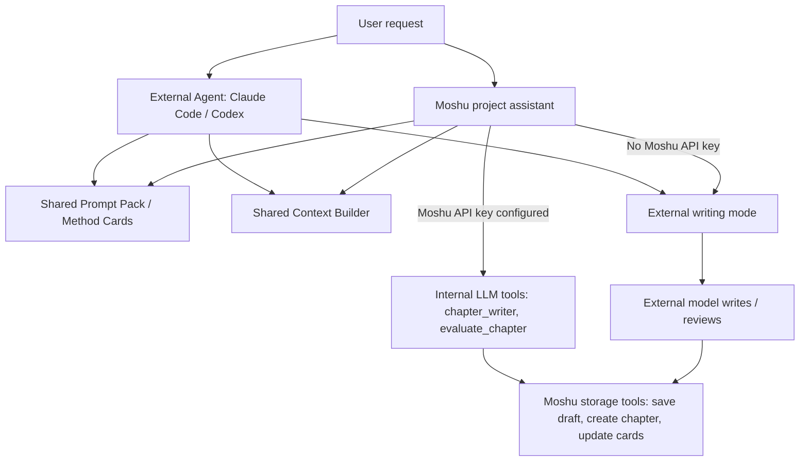

# Novel Creation And External Writing Task Board

> Project: Moshu / 墨枢
>
> Purpose: make the project assistant and external agents share the same novel-writing method prompts, support new-novel creation, and allow Claude Code / Codex to write novels through Moshu without requiring any model API keys configured inside Moshu.
>
> Product design source: `docs/agent/novel-project-creation-agent-tasks.md`

## Status Legend

- `[ ]` not started
- `[-]` in progress
- `[x]` completed and verified
- `[!]` blocked, with blocker written under the task

## Strict Execution Rules

1. Claim exactly one task by changing `[ ]` to `[-]` and writing your name or handle.
2. Stay inside the listed file scope. If another file must be touched, write the reason under the task before editing.
3. Do not duplicate prompt logic. Shared prompt/method content must come from one source used by both internal assistant and MCP/external agents.
4. External-agent workflows must work when Moshu has no model API configured. In that mode, Moshu provides context, prompt packs, storage, telemetry, and write APIs; Claude Code / Codex performs generation and review.
5. Internal API-backed tools may still exist, but every writing workflow must have a no-internal-API external path.
6. Never expose API keys, model secrets, tokens, or secret-management tools to MCP or prompt-pack APIs.
7. Do not expose hidden chain-of-thought. Expose plans, tool calls, selected context, method prompts, quality rubrics, draft chunks, warnings, and write results.
8. Preserve codebase consistency. New models, schemas, routers, services, tools, prompts, frontend types, and docs must follow existing naming, return contracts, permission-pack rules, runtime schema sync, and UI patterns.
9. Do not introduce a second source of truth. Tool metadata must come from `ToolRegistry`; frontend tool catalogs must derive from backend catalog APIs; prompt/method text must derive from shared prompt-pack data.
10. Mark `[x]` only after running the listed verification commands and writing the result under the task.
11. Each verified function should be committed and pushed separately.

## Architecture Contract

The final system must support two equivalent writing modes:



Required boundary:

- Project assistant and external agents must read the same public writing prompt pack and quality rubric summaries.
- External agents must not need `chapter_writer` or `evaluate_chapter` when Moshu has no API key.
- External agents should still be able to call API-free tools: context preparation, prompt pack retrieval, draft saving, quality review recording, chapter creation, and story-data updates.

## Consistency Contract

Every implementation task must preserve the existing Moshu architecture:

- **Backend layering**: routers only validate HTTP/API shape and call services; services hold business logic; workspace tools remain thin command handlers; prompt construction stays under `backend/app/prompts` or `backend/app/services/agent`.
- **Tool source**: every new callable capability is registered once in `backend/app/services/workspace/registry.py`; internal assistant, scheduler, MCP, and frontend catalog must all derive from that registry.
- **Return contract**: workspace tools return `{tool, status, detail, data}` and use `warnings`, `refs`, or `next_suggestions` when applicable. Long generated content must be stored by ref instead of copied through later tool calls.
- **Permission consistency**: MCP exposure, scheduler exposure, destructive-write confirmation, and secret-tool deny rules must stay aligned with existing permission-pack policy.
- **Schema consistency**: every backend response shape used by frontend must have a matching TypeScript type or local interface. Do not silently change existing response fields without a compatibility shim.
- **Runtime schema consistency**: new database tables/columns must be compatible with old user databases created by previous exe versions.
- **Prompt consistency**: project assistant, external agent prompt tools, scheduled tasks, and plan agent must use the same public prompt-pack versions for the same workflow.
- **Context consistency**: RAG/context selection must expose source metadata and warnings in the same format used by existing `context_snapshot` / context preview panels.
- **UI consistency**: new frontend pages should follow existing Ant Design table/modal/drawer patterns, sidebar menu conventions, and live run display components.
- **Documentation consistency**: README, MCP docs, packaging docs, and task boards must use the same terminology: "project assistant", "external agent", "Prompt Pack", "Method Card", "permission pack", and "No Moshu API mode".

## Phase 0 - Spec And Safety

### NOVEL-0001 - Write Shared Prompt Pack Contract

- Status: `[x]`
- Owner: Claude Code
- File scope:
  - `docs/agent/shared-prompt-pack-contract.md`
  - `docs/agent/novel-project-creation-task-board.md`
- Goal:
  - Define how internal project assistant and external agents access the same writing methods.
- Required content:
  - Distinguish hidden internal system prompts from public method prompts.
  - Define public prompt pack fields: `id`, `version`, `scope`, `title`, `summary`, `system_prompt`, `workflow`, `quality_rubric`, `tool_playbook`, `forbidden_patterns`, `context_policy`, `output_contract`.
  - Define scopes: `new_project`, `chapter_writing`, `chapter_review`, `character_design`, `worldbuilding`, `outline_planning`, `anti_ai_review`.
  - Define compatibility rule: internal assistant prompt builder must consume the same public pack data or generated section as MCP prompt tools.
  - Define redaction rule: public prompt packs must not include API keys, model secrets, private environment paths, or hidden chain-of-thought requirements.
- Verification:
  - `Test-Path docs/agent/shared-prompt-pack-contract.md`
  - Reviewer can implement NOVEL-0101 through NOVEL-0105 from the spec without hidden assumptions.

### NOVEL-0002 - Define External No-API Writing Workflow

- Status: `[x]`
- Owner: Claude Code
- File scope:
  - `docs/agent/external-no-api-writing.md`
- Goal:
  - Document the exact workflow when Moshu has no model API configured and Claude Code / Codex does the writing.
- Required content:
  - Step-by-step flow: list projects -> select project -> get prompt pack -> prepare context -> external model writes -> external model self-reviews -> save draft -> create/update chapter -> update character/worldbuilding/outline.
  - Which tools are API-free and safe to call.
  - Which tools require Moshu API keys and must be skipped in external-only mode.
  - Required frontend telemetry events for external writing.
  - Failure handling: missing outline, missing context, user rejects draft, write confirmation needed.
- Verification:
  - `Test-Path docs/agent/external-no-api-writing.md`
  - Document names at least 8 API-free tools and at least 6 API-backed tools to avoid in no-API mode.

### NOVEL-0003 - Keep This Task Board Current

- Status: `[-]`
- Owner: Codex
- File scope:
  - `docs/agent/novel-project-creation-task-board.md`
- Goal:
  - Maintain this board as the strict source for distributed implementation.
- Verification:
  - `Get-Content docs/agent/novel-project-creation-task-board.md | Select-String "NOVEL-0001"`

## Phase 1 - Shared Prompt And Method Data

### NOVEL-0101 - Add PromptPack Method Models

- Status: `[x]`
- Owner: Claude Code
- Depends on:
  - NOVEL-0001
- File scope:
  - `backend/app/database/models.py`
  - `backend/app/schemas/prompt_pack.py`
  - `backend/tests/test_prompt_pack_models.py`
- Goal:
  - Persist public prompt packs and method cards that can be read by internal assistant and external agents.
- Required behavior:
  - Add `PublicPromptPack` model.
  - Add `MethodCard` model if not already implemented.
  - Support project-level override and built-in global defaults.
  - Fields must include versioning, enabled state, builtin flag, tags JSON, and updated timestamps.
  - Runtime schema sync must create tables for old user databases.
- Verification:
  - `py -m pytest backend/tests/test_prompt_pack_models.py -q`
  - Test confirms old runtime schema can add new tables without data loss.

### NOVEL-0102 - Seed Built-In Novel Writing Prompt Packs

- Status: `[x]`
- Owner: Claude Code
- Depends on:
  - NOVEL-0101
- File scope:
  - `backend/app/services/prompt_packs/seed.py`
  - `backend/app/services/prompt_packs/__init__.py`
  - `backend/tests/test_prompt_pack_seed.py`
- Goal:
  - Provide built-in public prompt packs for writing and project creation.
- Required packs:
  - `new_project_setup`
  - `chapter_writing_quality`
  - `chapter_writing_fast`
  - `chapter_review_quality`
  - `character_design`
  - `worldbuilding_design`
  - `outline_planning`
  - `anti_ai_review`
- Required behavior:
  - Seed on first access.
  - Built-ins cannot be deleted, but can be disabled or overridden per project.
  - Prompt content should summarize Moshu writing methodology and tool workflow, not copy private hidden prompts verbatim.
- Verification:
  - `py -m pytest backend/tests/test_prompt_pack_seed.py -q`
  - Test confirms all required pack ids exist after seeding.

### NOVEL-0103 - Expose Prompt Pack Read Tools

- Status: `[x]`
- Owner: Claude Code
- Depends on:
  - NOVEL-0102
- File scope:
  - `backend/app/services/workspace/tools/prompt_packs.py`
  - `backend/app/services/workspace/registry.py`
  - `backend/tests/test_prompt_pack_tools.py`
- Goal:
  - Let project assistant, scheduler, and external agents read the same public prompts.
- Tools:
  - `list_prompt_packs`
  - `get_prompt_pack`
  - `get_tool_playbook`
  - `get_quality_rubric`
- Required behavior:
  - Tools must be API-free.
  - Tools must be exposed to internal assistant, scheduler, and MCP readonly collaboration pack.
  - `get_prompt_pack(scope="chapter_writing", mode="quality")` returns a complete external-operating prompt suitable for Claude Code / Codex.
  - `get_tool_playbook(tool_name="create_chapter", scenario="external_writing")` explains how to save externally generated text.
- Verification:
  - `py -m pytest backend/tests/test_prompt_pack_tools.py -q`
  - `py scripts/check-tool-registry.py`

### NOVEL-0104 - Make Internal Assistant Use Shared Prompt Pack Sections

- Status: `[x]`
- Owner: Claude Code
- Depends on:
  - NOVEL-0103
- File scope:
  - `backend/app/services/agent/prompt_builder.py`
  - `backend/app/prompts/packs/workspace_quality.py`
  - `backend/app/prompts/packs/workspace_fast.py`
  - `backend/tests/test_workspace_prompt_pack_integration.py`
- Goal:
  - Ensure project assistant and external agents read equivalent writing rules.
- Required behavior:
  - Internal workspace prompt builder must inject selected public prompt pack sections.
  - No duplicate hard-coded copy of the same writing workflow in separate files.
  - Quality mode must include the same public chapter workflow and quality rubric that external agents can fetch.
  - Fast mode must include the same public fast workflow that external agents can fetch.
- Verification:
  - `py -m pytest backend/tests/test_workspace_prompt_pack_integration.py -q`
  - Test compares internal prompt section hash with `get_prompt_pack` returned section hash.

### NOVEL-0105 - Index Prompt Packs And Method Cards In RAG

- Status: `[x]`
- Owner: Claude Code
- Depends on:
  - NOVEL-0101
- File scope:
  - `backend/app/services/rag/indexer.py`
  - `backend/app/services/rag/retriever.py`
  - `backend/tests/test_prompt_pack_rag.py`
- Goal:
  - Make method prompts searchable by project assistant and external context tools.
- Required behavior:
  - Add source types: `prompt_pack`, `method_card`, `tool_playbook`.
  - Refresh index when prompt packs or method cards change.
  - Search results must never include disabled packs.
- Verification:
  - `py -m pytest backend/tests/test_prompt_pack_rag.py -q`

## Phase 2 - API-Free External Writing Tools

### NOVEL-0201 - Add External Writing Context Tool

- Status: `[x]`
- Owner: Claude Code
- Depends on:
  - NOVEL-0103
- File scope:
  - `backend/app/services/workspace/tools/external_writing.py`
  - `backend/app/services/workspace/registry.py`
  - `backend/tests/test_external_writing_context.py`
- Goal:
  - Build a writing context package for external agents without calling LLM APIs.
- Tool:
  - `prepare_external_writing_context`
- Required input:
  - `project_id`
  - `outline_node_id?`
  - `chapter_number?`
  - `requirements?`
  - `mode`: `fast | quality`
  - `include_prompt_pack`: default true
- Required output:
  - `prompt_pack`
  - `context_sections`
  - `outline`
  - `recent_summaries`
  - `characters`
  - `relationships`
  - `worldbuilding`
  - `forbidden_patterns`
  - `quality_rubric`
  - `warnings`
  - `next_tool_suggestions`
- Required behavior:
  - Must not call `LLMGateway`.
  - Must use existing RAG/context packer.
  - Must explain why each context section was selected.
  - Must return enough instructions for Claude Code / Codex to write without `chapter_writer`.
- Verification:
  - `py -m pytest backend/tests/test_external_writing_context.py -q`
  - Test monkeypatches `LLMGateway.chat_completion` to raise and confirms tool still succeeds.

### NOVEL-0202 - Add External Draft Storage

- Status: `[ ]`
- Owner:
- Depends on:
  - NOVEL-0201
- File scope:
  - `backend/app/services/workspace/tools/external_writing.py`
  - `backend/app/services/workspace/generated_drafts.py`
  - `backend/tests/test_external_draft_storage.py`
- Goal:
  - Let external agents save generated drafts before committing them as chapters.
- Tools:
  - `save_external_chapter_draft`
  - `get_external_chapter_draft`
- Required behavior:
  - Store full content server-side and return `draft_id/content_ref`.
  - Support title, outline_node_id, source_agent, quality_review_json, context_snapshot.
  - Do not require Moshu API key.
  - Drafts can be passed to `create_chapter`, `update_chapter`, `detect_character_changes`, and `detect_new_worldbuilding`.
- Verification:
  - `py -m pytest backend/tests/test_external_draft_storage.py -q`

### NOVEL-0203 - Add External Quality Review Record Tool

- Status: `[ ]`
- Owner:
- Depends on:
  - NOVEL-0202
- File scope:
  - `backend/app/services/workspace/tools/external_writing.py`
  - `backend/app/database/models.py`
  - `backend/tests/test_external_quality_review.py`
- Goal:
  - Let Claude Code / Codex record its own quality review when Moshu has no API key.
- Tool:
  - `record_external_quality_review`
- Required behavior:
  - Accept `draft_id/content_ref` or `chapter_id`.
  - Accept structured review: scores, issues, revision suggestions, pass/fail, reviewer_model, prompt_pack_version.
  - Persist review metadata without overwriting internal `evaluate_chapter` results unless explicitly requested.
  - Return a normalized review summary that frontend can display.
- Verification:
  - `py -m pytest backend/tests/test_external_quality_review.py -q`

### NOVEL-0204 - Add External Story Update Application Tool

- Status: `[ ]`
- Owner:
- Depends on:
  - NOVEL-0202
- File scope:
  - `backend/app/services/workspace/tools/external_story_updates.py`
  - `backend/app/services/workspace/registry.py`
  - `backend/tests/test_external_story_updates.py`
- Goal:
  - Let external agents propose and apply character/worldbuilding/outline updates after writing.
- Tool:
  - `apply_external_story_updates`
- Required behavior:
  - Input contains proposed updates grouped by `characters`, `relationships`, `worldbuilding`, `outline`, `chapter_summary`.
  - Manual mode returns write candidates without applying.
  - Auto mode applies safe create/update operations but still obeys MCP permission pack and confirmation-token rules.
  - Must merge current-state fields by overwrite and long-form fields by rewrite-merge rules.
  - Must create human-readable version history titles: include chapter title and main change, not generic "AI update".
- Verification:
  - `py -m pytest backend/tests/test_external_story_updates.py -q`

### NOVEL-0205 - External Writing End-To-End No-API Test

- Status: `[ ]`
- Owner:
- Depends on:
  - NOVEL-0201
  - NOVEL-0202
  - NOVEL-0203
  - NOVEL-0204
- File scope:
  - `backend/tests/test_external_writing_no_api_e2e.py`
- Goal:
  - Prove external agents can write a chapter without any Moshu model API.
- Required behavior:
  - Monkeypatch all LLM gateway calls to fail.
  - Call `prepare_external_writing_context`.
  - Simulate external model text.
  - Call `save_external_chapter_draft`.
  - Call `record_external_quality_review`.
  - Call `create_chapter` with `draft_id/content_ref`.
  - Call `apply_external_story_updates` in manual mode.
- Verification:
  - `py -m pytest backend/tests/test_external_writing_no_api_e2e.py -q`

## Phase 3 - New Novel Creation

### NOVEL-0301 - Add Novel Creation Session Model

- Status: `[ ]`
- Owner:
- File scope:
  - `backend/app/database/models.py`
  - `backend/app/schemas/novel_creation.py`
  - `backend/tests/test_novel_creation_session.py`
- Goal:
  - Record a complete new-novel setup session.
- Required behavior:
  - Model fields: `id`, `source_project_id`, `created_project_id`, `status`, `mode`, `user_brief`, `target_audience`, `genre`, `platform`, `blueprint_json`, `review_json`, timestamps.
  - Runtime schema migration must work for old data.
  - Sessions can resume after failure.
- Verification:
  - `py -m pytest backend/tests/test_novel_creation_session.py -q`

### NOVEL-0302 - Add API-Free New Novel Brief Tool

- Status: `[ ]`
- Owner:
- Depends on:
  - NOVEL-0103
  - NOVEL-0301
- File scope:
  - `backend/app/services/workspace/tools/novel_creation.py`
  - `backend/app/services/workspace/registry.py`
  - `backend/tests/test_novel_creation_brief.py`
- Goal:
  - Let project assistant or external agent gather and structure a user's new-novel brief without calling an internal LLM.
- Tool:
  - `start_novel_creation_session`
- Required behavior:
  - Create or resume a `NovelCreationSession`.
  - Return the relevant prompt pack and interview checklist.
  - Identify missing fields deterministically when possible.
  - Must not call LLM.
- Verification:
  - `py -m pytest backend/tests/test_novel_creation_brief.py -q`

### NOVEL-0303 - Add Blueprint Draft Tool With Internal And External Modes

- Status: `[ ]`
- Owner:
- Depends on:
  - NOVEL-0302
- File scope:
  - `backend/app/services/workspace/tools/novel_creation.py`
  - `backend/tests/test_novel_blueprint_draft.py`
- Goal:
  - Support both Moshu-internal and external-agent blueprint generation.
- Tool:
  - `draft_novel_blueprint`
- Required behavior:
  - `execution_mode="internal_llm"` may call Moshu API if configured.
  - `execution_mode="external_agent"` must not call Moshu API; it returns prompt/context/output schema for external agent to fill.
  - Output contract includes `blueprints[]`, `next_questions`, and `apply_requirements`.
  - Save draft blueprint to session.
- Verification:
  - `py -m pytest backend/tests/test_novel_blueprint_draft.py -q`
  - Test confirms external mode succeeds when LLM gateway is unavailable.

### NOVEL-0304 - Add Blueprint Review Tool With Internal And External Modes

- Status: `[ ]`
- Owner:
- Depends on:
  - NOVEL-0303
- File scope:
  - `backend/app/services/workspace/tools/novel_creation.py`
  - `backend/tests/test_novel_blueprint_review.py`
- Goal:
  - Review new-novel blueprints with either internal or external model support.
- Tool:
  - `review_novel_blueprint`
- Required behavior:
  - Internal mode may call Moshu API.
  - External mode returns review prompt, rubric, expected JSON schema, and lets external agent submit filled review.
  - Review dimensions: premise clarity, protagonist goal, conflict engine, world rules, character relationship pressure, golden-three hook, 30-chapter runway, trope freshness.
  - Store review on session.
- Verification:
  - `py -m pytest backend/tests/test_novel_blueprint_review.py -q`

### NOVEL-0305 - Apply Novel Blueprint

- Status: `[ ]`
- Owner:
- Depends on:
  - NOVEL-0303
  - NOVEL-0304
- File scope:
  - `backend/app/services/workspace/tools/novel_creation.py`
  - `backend/tests/test_apply_novel_blueprint.py`
- Goal:
  - Turn a confirmed blueprint into a real Moshu project with useful starter data.
- Tool:
  - `apply_novel_blueprint`
- Required behavior:
  - Create project.
  - Create worldbuilding entries.
  - Create core characters.
  - Create relationships.
  - Create volume and first 10 chapter outline nodes.
  - Create project skills and memories when provided.
  - Idempotent per session: retries must not duplicate same named records.
  - Manual mode returns candidates; auto mode applies after confirmation policy.
- Verification:
  - `py -m pytest backend/tests/test_apply_novel_blueprint.py -q`

## Phase 4 - Plan Agent And Project Assistant Integration

### NOVEL-0401 - Add Create-Novel Intent To Plan Agent

- Status: `[ ]`
- Owner:
- Depends on:
  - NOVEL-0305
- File scope:
  - `backend/app/services/agent/planner.py`
  - `backend/app/services/agent/bridge.py`
  - `backend/tests/test_plan_create_novel.py`
- Goal:
  - Make project assistant understand "帮我开一本新小说" as a plan, not simple chat.
- Required behavior:
  - Fast mode: one blueprint, lightweight review, ask confirmation before apply unless auto_apply true.
  - Quality mode: 2-3 blueprints, stronger review, user choice required before apply.
  - If Moshu API is unavailable, switch to external-agent prompt/context mode and explain next action.
- Verification:
  - `py -m pytest backend/tests/test_plan_create_novel.py -q`

### NOVEL-0402 - Add External Writing Intent To Plan Agent

- Status: `[ ]`
- Owner:
- Depends on:
  - NOVEL-0205
- File scope:
  - `backend/app/services/agent/planner.py`
  - `backend/app/routers/agent.py`
  - `backend/tests/test_plan_external_writing.py`
- Goal:
  - Support a plan path where writing is done by external Claude Code / Codex.
- Required behavior:
  - Plan steps: prepare context -> wait for external draft -> save draft -> record review -> create/update chapter -> apply story updates.
  - Frontend must show a blocked/waiting state while expecting external text.
  - Resume from failed step must work.
- Verification:
  - `py -m pytest backend/tests/test_plan_external_writing.py -q`

### NOVEL-0403 - Align Quality Mode With Shared Prompt Pack

- Status: `[ ]`
- Owner:
- Depends on:
  - NOVEL-0104
- File scope:
  - `backend/app/services/agent/prompt_builder.py`
  - `backend/app/services/agent/planner.py`
  - `backend/tests/test_quality_mode_shared_prompts.py`
- Goal:
  - Quality mode should use the same publicly readable quality rules that external agents can fetch.
- Required behavior:
  - Quality mode still runs `preview_writing_context`, `design_plot`, roleplay, `chapter_writer`, `evaluate_chapter`, save, detect.
  - The visible prompt pack version is recorded in plan metadata and chapter draft metadata.
  - External and internal quality rules have matching version ids.
- Verification:
  - `py -m pytest backend/tests/test_quality_mode_shared_prompts.py -q`

## Phase 5 - MCP Exposure

### NOVEL-0501 - Expose Prompt Pack Tools Through MCP

- Status: `[ ]`
- Owner:
- Depends on:
  - NOVEL-0103
- File scope:
  - `backend/app/mcp/adapter.py`
  - `backend/tests/test_mcp_prompt_pack_tools.py`
- Goal:
  - Claude Code / Codex can fetch Moshu writing methods from MCP.
- Required behavior:
  - `list_prompt_packs`, `get_prompt_pack`, `get_tool_playbook`, and `get_quality_rubric` appear in `readonly_collaboration`.
  - No secret tools appear in any pack.
- Verification:
  - `py -m pytest backend/tests/test_mcp_prompt_pack_tools.py -q`

### NOVEL-0502 - Expose External Writing Tools Through MCP

- Status: `[ ]`
- Owner:
- Depends on:
  - NOVEL-0205
- File scope:
  - `backend/app/mcp/adapter.py`
  - `backend/tests/test_mcp_external_writing_tools.py`
- Goal:
  - External agents can write without Moshu API through MCP.
- Required behavior:
  - `prepare_external_writing_context` is readonly.
  - `save_external_chapter_draft` is draft_generation or project_writing depending on persistence risk, as defined in permission policy.
  - `record_external_quality_review` and `apply_external_story_updates` obey write confirmation rules.
  - `project_id` override works so external agents can access all projects when permission pack allows it.
- Verification:
  - `py -m pytest backend/tests/test_mcp_external_writing_tools.py -q`

### NOVEL-0503 - Expose New Novel Creation Tools Through MCP

- Status: `[ ]`
- Owner:
- Depends on:
  - NOVEL-0305
- File scope:
  - `backend/app/mcp/adapter.py`
  - `backend/tests/test_mcp_novel_creation_tools.py`
- Goal:
  - External agents can create new novels through the same flow as the project assistant.
- Required behavior:
  - `start_novel_creation_session` and external-mode `draft/review` preparation are readonly or draft.
  - `apply_novel_blueprint` requires project_management or project_writing plus confirmation.
  - Tools must be visible in tool catalog and permission settings UI.
- Verification:
  - `py -m pytest backend/tests/test_mcp_novel_creation_tools.py -q`
  - `py scripts/check-tool-registry.py`

### NOVEL-0504 - Update Claude Code / Codex Operating Docs

- Status: `[ ]`
- Owner:
- Depends on:
  - NOVEL-0501
  - NOVEL-0502
  - NOVEL-0503
- File scope:
  - `docs/mcp/claude-code-codex-client.md`
  - `README.md`
- Goal:
  - Explain exactly how external agents should write and create novels through Moshu.
- Required content:
  - How to configure MCP for all projects.
  - How to fetch prompt packs.
  - How to write a chapter without Moshu API.
  - How to create a new novel without Moshu API.
  - Which tools require confirmation.
  - Troubleshooting: "chapter_writer fails because no API key".
- Verification:
  - `Get-Content docs/mcp/claude-code-codex-client.md | Select-String "No Moshu API"`
  - `Get-Content README.md | Select-String "external agent"`

## Phase 6 - Frontend And Observability

### NOVEL-0601 - Add Prompt Pack Browser UI

- Status: `[ ]`
- Owner:
- Depends on:
  - NOVEL-0103
- File scope:
  - `frontend/src/pages/PromptPacksPage.tsx`
  - `frontend/src/pages/ProjectWorkspace.tsx`
  - `frontend/src/api/client.ts`
- Goal:
  - Users can inspect and edit project-level public prompt packs.
- Required behavior:
  - Show built-in and project override packs.
  - Display version, scope, enabled state, and last updated time.
  - Allow copying an external-agent prompt.
  - Built-ins cannot be deleted.
- Verification:
  - `cd frontend; npm run build`

### NOVEL-0602 - Add External Writing Panel

- Status: `[ ]`
- Owner:
- Depends on:
  - NOVEL-0205
- File scope:
  - `frontend/src/components/ExternalWritingPanel.tsx`
  - `frontend/src/components/WorkspaceAssistantChat.tsx`
  - `frontend/src/types/externalWriting.ts`
- Goal:
  - Let users see and control the external-agent writing workflow.
- Required behavior:
  - Show selected prompt pack, selected context, draft chunks, review, warnings, and write candidates.
  - Support copy prompt/context to clipboard.
  - Support paste external draft and save as draft.
  - Support confirm/reject create chapter.
- Verification:
  - `cd frontend; npm run build`

### NOVEL-0603 - Add New Novel Creation Wizard

- Status: `[ ]`
- Owner:
- Depends on:
  - NOVEL-0305
- File scope:
  - `frontend/src/pages/NovelCreationWizardPage.tsx`
  - `frontend/src/pages/ProjectWorkspace.tsx`
  - `frontend/src/api/client.ts`
- Goal:
  - Provide a UI for users who want to start a new novel from scratch.
- Required behavior:
  - User enters brief.
  - Shows generated blueprint candidates.
  - Allows editing worldbuilding/characters/outline/skills before apply.
  - Shows write candidates and confirmation.
  - Works for both internal API-backed and external-agent modes.
- Verification:
  - `cd frontend; npm run build`

### NOVEL-0604 - Show Shared Prompt Version In Runs

- Status: `[ ]`
- Owner:
- Depends on:
  - NOVEL-0403
- File scope:
  - `frontend/src/components/AgentPlanView.tsx`
  - `frontend/src/components/ExternalAgentRunPanel.tsx`
  - `backend/app/services/external_agent/run_service.py`
- Goal:
  - Make prompt version and context selection auditable.
- Required behavior:
  - Every writing run displays prompt pack id/version.
  - Context snapshot displays selected sections and warnings.
  - Quality review displays reviewer source: internal Moshu model or external agent.
- Verification:
  - `cd frontend; npm run build`
  - `py -m pytest backend/tests/test_external_agent_runs.py -q`

## Phase 7 - Regression And Release

### NOVEL-0701 - Backend Regression Gate

- Status: `[ ]`
- Owner:
- Depends on:
  - NOVEL-0503
- File scope:
  - all touched backend areas
- Goal:
  - Ensure no regressions in assistant, MCP, registry, RAG, and old user data.
- Verification:
  - `py -m pytest`
  - `py scripts/check-tool-registry.py`

### NOVEL-0702 - Frontend Regression Gate

- Status: `[ ]`
- Owner:
- Depends on:
  - NOVEL-0604
- File scope:
  - all touched frontend areas
- Goal:
  - Ensure UI builds and navigation works.
- Verification:
  - `cd frontend; npm run build`

### NOVEL-0703 - Manual Smoke Test

- Status: `[ ]`
- Owner:
- Depends on:
  - NOVEL-0701
  - NOVEL-0702
- File scope:
  - `docs/agent/novel-creation-smoke-test.md`
- Goal:
  - Document and run a human smoke test before release.
- Required smoke cases:
  - Internal API-backed project assistant writes a chapter in quality mode.
  - External Claude/Codex writes a chapter with no Moshu API key.
  - External Claude/Codex creates a new novel with no Moshu API key.
  - User can inspect the prompt pack used by both paths.
  - Old projects still open and can write chapters.
- Verification:
  - `Test-Path docs/agent/novel-creation-smoke-test.md`
  - Smoke test result pasted under this task before marking `[x]`.

### NOVEL-0704 - Cross-Codebase Consistency Audit

- Status: `[ ]`
- Owner:
- Depends on:
  - NOVEL-0701
  - NOVEL-0702
- File scope:
  - `docs/agent/novel-creation-consistency-audit.md`
  - all touched backend/frontend/docs areas, read-only unless a bug fix is explicitly recorded here first
- Goal:
  - Verify the implementation is consistent across backend, frontend, MCP, prompts, tools, tests, and docs.
- Required audit checklist:
  - New tools are registered once in `ToolRegistry` and visible through the correct internal/scheduler/MCP/frontend catalog paths.
  - Tool schemas, backend handlers, MCP adapter schemas, and frontend call sites use the same argument names.
  - Every long-content workflow uses `draft_id/content_ref` rather than passing full chapter text through repeated calls.
  - Prompt packs used internally match prompt packs exposed to external agents by id/version.
  - Runtime schema sync covers every new table and column.
  - Old projects created by previous exe versions still open and can write/edit chapters.
  - Permission packs do not expose API key/model secret/config secret tools.
  - Frontend pages use existing menu, modal, drawer, table, status badge, and live-run display conventions.
  - README, MCP docs, packaging docs, and UI labels use the same feature names.
  - Tests cover both internal API-backed mode and external no-API mode.
- Verification:
  - `py -m pytest`
  - `py scripts/check-tool-registry.py`
  - `cd frontend; npm run build`
  - `Test-Path docs/agent/novel-creation-consistency-audit.md`

### NOVEL-0705 - Compatibility Test With Old User Data

- Status: `[ ]`
- Owner:
- Depends on:
  - NOVEL-0704
- File scope:
  - `backend/tests/test_old_data_compatibility.py`
  - `docs/agent/old-data-compatibility-notes.md`
- Goal:
  - Ensure users who already ran older exe builds can upgrade without losing data or hitting missing-column errors.
- Required behavior:
  - Test starts from a minimal old-style database fixture that lacks new prompt-pack, method-card, external-writing, and novel-creation tables.
  - Runtime schema sync creates missing tables/columns.
  - Existing projects, chapters, characters, outline nodes, worldbuilding entries, skills, scheduled tasks, and settings remain readable.
  - Newly added features can be used on an old project after migration.
- Verification:
  - `py -m pytest backend/tests/test_old_data_compatibility.py -q`
  - `Test-Path docs/agent/old-data-compatibility-notes.md`

## Completion Log

Append completed-task evidence here. Use one entry per task:

```text
### YYYY-MM-DD
- NOVEL-xxxx: command -> result. Notes.
```

### 2026-06-09

- NOVEL-0001: `Test-Path docs/agent/shared-prompt-pack-contract.md` — file exists, 9 sections. Covers hidden vs public prompts, prompt pack fields (14 fields), scopes (7 scopes), compatibility rules, redaction rules, storage/indexing, backward compatibility.
- NOVEL-0002: `Test-Path docs/agent/external-no-api-writing.md` — file exists, 7 sections. 10-step workflow documented. 19 API-free tools listed. 14 API-backed tools to skip. Failure handling for 4 scenarios. Example session included.
- NOVEL-0101: `py -m pytest tests/test_prompt_pack_models.py -q` — 10 passed. Added PublicPromptPack model (project_id, pack_id, version, scope, title, system_prompt, workflow/rubric/playbook/patterns/context/output JSON fields, enabled, is_builtin, tags) and MethodCard model (project_id, card_id, version, title, content_json, card_type, enabled, is_builtin). Pydantic schemas (Create, Read) for both.
- NOVEL-0102: `py -m pytest tests/test_prompt_pack_seed.py -q` — 8 passed, 21 subtests. Added prompt_packs/seed.py with 8 built-in packs (new_project_setup, chapter_writing_quality, chapter_writing_fast, chapter_review_quality, character_design, worldbuilding_design, outline_planning, anti_ai_review). Each pack has system_prompt, workflow, quality_rubric, forbidden_patterns. Seed is idempotent.
- NOVEL-0103: `py -m pytest tests/test_prompt_pack_tools.py -q` — 8 passed. `py scripts/check-tool-registry.py` — PASS, 110 tools. Added 4 prompt pack tools to workspace registry: list_prompt_packs, get_prompt_pack, get_tool_playbook, get_quality_rubric. All registered as tool_type=read → readonly tier. Tools appear in MCP readonly_collaboration pack.
- NOVEL-0104: `py -m pytest tests/test_workspace_prompt_pack_integration.py -q` — 4 passed. Added inject_public_prompt_pack_section() to prompt_builder.py. Appends public pack title/version/summary/rubric/forbidden_patterns to system prompt. Gracefully handles missing pack or DB errors.
- NOVEL-0105: `py -m pytest tests/test_prompt_pack_rag.py -q` — 5 passed. Added _index_prompt_pack and _index_method_card to RAG indexer. Updated reindex_project_types to handle prompt_pack and method_card source types. Prompt packs indexed with scope/version metadata.
- NOVEL-0201: `py -m pytest tests/test_external_writing_context.py -q` — 5 passed. Added prepare_external_writing_context tool (API-free). Returns prompt pack, outline, characters, relationships, worldbuilding, recent summaries, quality rubric, forbidden patterns, warnings, next tool suggestions. Registered in readonly_collaboration pack.
