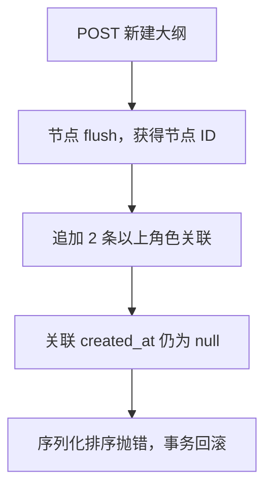

# 司命 3.3.8 大纲保存与持久化生命周期修复实施文档

> 状态：本地实施完成，等待远程 CI、合并与正式发布
> 发布目标：`3.3.8`
> 审计基线：源码版本 `3.3.7`，提交 `352c1035b005f064ac6f31dc15b88bc3035a7873`
> 用户证据：`QQ20260829-211601.mp4`
> 适用范围：PC 大纲与角色编辑器、后端大纲写入、AI 大纲工具/草稿、建档写入审计、Gateway/Android 契约回归、发布流程

## 1. 结论

用户反馈的“新建大纲保存不了”已经定位为确定性后端缺陷，不是排序数字导致，也不是偶发网络问题。

触发条件是：**新建大纲节点时一次关联至少 2 个角色**。后端先创建节点并 `flush`，随后把多条尚未落库的角色关联追加到关系集合，又立即按关联记录的 `created_at` 排序生成响应。此时这些新关联的 `created_at` 均为 `None`；Python 在第二条记录开始需要比较两个 `None`，抛出 `TypeError`，整个事务回滚。

PC 前端在新建态隐藏了保存状态组件，异常分支又只记录状态、不弹出错误，所以用户看到的是“点击保存没有反应”。录屏中把排序值从 `1` 改成 `10` 仍然失败，符合上述触发机制：`sort_order` 不参与这次异常。

本次不能只在某个调用点补一行 `flush`。审计还发现 AI 大纲工具存在相同的“关联尚未物化便返回”问题，建档模块存在“读取数据库生成 ID 早于 flush”的同类生命周期问题，角色新建页也会隐藏创建失败。3.3.8 应统一收敛以下规则：

> 任何写入路径在读取数据库默认值、生成 ID 或序列化关系前，必须完成必要的 `flush`；任何客户端保存失败都必须可见且保留作者输入。

实施中额外确认了一处跨端契约缺口：Android 离线确认 AI 大纲草稿时曾把角色名称字符串直接写入 `characters`，而同步/Gateway 的权威契约要求 `{character_id, role_in_scene}` 对象。3.3.8 已在任何正式写入前用本机作品副本精确解析真实角色 ID；未知角色会整体拒绝，不产生部分节点。

## 2. 已验证的触发矩阵

| 操作 | 关联角色数 | 当前 3.3.7 结果 | 原因 |
| --- | ---: | --- | --- |
| PC 新建大纲 | 0 | 成功 | 无待排序关联 |
| PC 新建大纲 | 1 | 请求可成功，但响应中的关联可能不完整 | 单元素排序不比较键；关联对象仍未完整物化 |
| PC 新建大纲 | 2 | 失败并回滚 | 两个 `created_at=None` 参与排序，抛出 `TypeError` |
| PC 新建大纲 | 4 | 失败并回滚 | 与录屏一致，第二条关联即触发异常 |
| PC 新建大纲 | 2+，排序值改为 1/10 | 均失败 | 节点 `sort_order` 与关联记录 `created_at` 无关 |
| PC 编辑已有大纲并替换多个角色 | 2+ | 当前路径通常成功 | 更新路径在序列化前另有一次 `flush` |

在修复发布前，可向用户提供的临时绕过方式是：先以 0 或 1 个角色创建节点，再编辑该节点补齐其余角色。该方式仅用于应急，不视为修复。

## 3. 当前故障链路



前端随后进入 `catch`，但新建态不渲染 `SaveStatusIndicator`，因此服务器错误没有显示给作者。

关键代码位置：

- `backend/app/modules/story/infrastructure/outline.py`
  - `SqlAlchemyOutlineWorkspace.create()` 在替换角色关联后立即调用 `node_to_dict()`。
  - `update()` 因序列化前额外执行 `self._session.flush()`，没有同样的直接触发条件。
- `backend/app/services/outline_service.py`
  - `replace_character_links()` 清空旧关系后会 `flush`，但追加新关系后不再 `flush`。
  - `node_to_dict()` 直接以 `item.created_at` 为排序键，没有空值与稳定次级键保护。
- `frontend/src/pages/OutlinePage.tsx`
  - 保存异常只调用 `markSaveFailed()`。
  - 保存状态只在 `!creating && selectedNode` 时显示，新建失败时不可见。

## 4. 同类问题审计结果

### 4.1 必须随 3.3.8 修复

| 优先级 | 位置 | 问题 | 当前影响 |
| --- | --- | --- | --- |
| P0 | 手工大纲新建 | 多条未 flush 的关联按 `created_at` 排序 | 关联 2 个以上角色时 500 并回滚 |
| P0 | 大纲新建前端 | 新建态隐藏保存错误 | 用户看到“保存没反应”，无法判断是否重试 |
| P1 | 角色新建前端 | 新建态同样隐藏保存错误 | 角色 POST 失败时表现为无响应，表单虽在但错误不可见 |
| P1 | AI 大纲角色关联 | 空列表被当作“不处理”；新增关系未在返回前物化 | AI 不能清空旧关联；工具返回/已确认草稿可能暂时漏掉新角色 |
| P1 | 建档时间线与章节摘要 | 在数据库生成 ID 前读取 `id` | 正式数据可以写入，但候选和应用日志的 `target_id` 可能为 `null` |

### 4.2 防御性加固

以下代码同样直接按 `created_at` 排序。当前建档编排顺序通常会先持久化事件，因此尚未确认存在用户可见故障；但只要以后传入 pending ORM 对象，就会重现同类异常，应在本次统一加固：

- `backend/app/services/cataloging/targeted_context.py`
  - 角色时间线排序。
  - 世界观时间线排序。
- `backend/app/services/cataloging/context.py`
  - 世界观详情时间线排序。

### 4.3 已检查且不需要同类业务修改

- 项目、章节、世界观和角色的主写入路径在返回前已有必要的 flush/commit，没有发现同样的“多条 pending 记录排序导致保存回滚”。
- Gateway 的权威大纲变更路径在替换关联后会 `flush`，当前写入语义安全；本次补充 4 角色、字段缺失保留与显式空列表清空的契约回归测试。
- Android 在线路径使用 Gateway 契约且已有错误状态；Android 离线确认 AI 大纲草稿的角色字段存在上述对象结构缺口，因此只修正这一条权威离线写入路径，不新增 UI 分支或补偿写入。

## 5. 修复目标与边界

### 5.1 目标

1. PC 新建大纲关联 0、1、2、4 个角色均能原子保存并立即返回完整关系。
2. 手工页面、AI 工具、草稿确认和 Gateway 使用一致的大纲角色关联语义。
3. 保存失败可见，作者输入和新建态不丢失，可直接修正并重试。
4. 数据库生成字段只在 flush 后读取，建档候选与应用日志保留有效目标 ID。
5. 所有内存排序能安全处理 pending 对象的空时间戳，并提供稳定次级排序键。
6. 不增加数据库迁移，不改变既有成功请求的响应结构。

### 5.2 不在本次范围

- 不重写大纲树编辑器或引入新的全局状态库。
- 不创建第二套大纲写入 API、fallback 或客户端补偿写入。
- 不以捕获并忽略 `TypeError`、移除角色排序或前端静默重试掩盖服务端错误。
- 不修改已经发布的 `v3.3.7` 标签；修复发布为新版本 `3.3.8`。
- 不顺带重构与本缺陷无关的建档业务规则。

## 6. 权威关联语义

`replace_character_links()` 作为唯一的 ID 关联替换原语；按角色名操作的 AI helper 必须先解析为 ID，再委托给该原语，不再自行维护第二套清空/追加逻辑。

| 输入状态 | 新建语义 | 更新语义 |
| --- | --- | --- |
| 字段未提供 | 创建为无关联 | 保留原关联 |
| `null` | 按未提供处理 | 保留原关联 |
| `[]` | 创建为无关联 | 明确清空全部关联 |
| 合法列表 | 去重后按输入顺序精确建立 | 去重后精确替换 |
| 列表含其他作品角色 ID | 整个节点写入失败 | 整次更新失败，旧关系保持不变 |
| AI 名称列表含无法解析项 | 在变更前返回结构化校验错误 | 在变更前返回结构化校验错误，旧关系保持不变 |

去重保留第一次出现的位置和对应 `role_in_scene`。不得静默丢弃未知角色后继续部分替换，因为这会把作者要求的完整关系降级为不完整关系。

## 7. 实施步骤

### 阶段 A：修复后端权威大纲写入（P0）

涉及文件：

- `backend/app/services/outline_service.py`
- `backend/app/modules/story/infrastructure/outline.py`
- `backend/tests/test_outline.py`

修改内容：

1. `replace_character_links()` 一次查询并保留目标 `Character` 对象映射，先完成所有归属校验，再清空旧关系。
2. 建立关联时同时设置 `character` 关系对象，而不只设置 `character_id`，保证当前 ORM 图可以立即序列化。
3. 追加完全部关联后执行一次 `db.flush()`；helper 只 flush、不 commit，事务所有权仍由上层应用服务持有。
4. `SqlAlchemyOutlineWorkspace.create()` 与 `update()` 均依赖 helper 的明确后置条件：返回时新增关联的 ID、时间戳和关系对象均已物化。
5. `node_to_dict()` 保留防御性排序，建议采用等价的稳定键：

   ```python
   key=lambda item: (
       item.created_at is None,
       item.created_at or datetime.min,
       item.character_id or "",
   )
   ```

6. 跨作品角色、无效父节点或序列化异常必须使节点和关系一起回滚，不允许留下半个大纲节点。

验收点：修复不能依赖调用者记住额外 flush；任何调用 `replace_character_links()` 后立即序列化的路径都必须安全。

### 阶段 B：修复 PC 保存错误反馈（P0/P1）

涉及文件：

- `frontend/src/pages/OutlinePage.tsx`
- `frontend/src/pages/CharactersPage.tsx`
- 新增 `frontend/src/__tests__/OutlinePage.test.tsx`
- 更新 `frontend/src/__tests__/CharactersPage.test.tsx`

修改内容：

1. 大纲页在新建态、编辑态和保存失败态都渲染 `SaveStatusIndicator`，不能再以 `selectedNode` 是否存在决定错误是否可见。
2. 角色页在 `editorTarget.mode === 'create'` 时同样显示保存状态。
3. 当前保存请求失败时：
   - 保持当前新建/编辑目标；
   - 保留表单值和 dirty 状态；
   - 显示持久化的内联错误，并通过 `message.error()` 给出一次即时反馈；
   - 恢复保存按钮，使作者可以直接重试；
   - 不刷新列表、不自动选择其他对象。
4. 错误信息优先使用 API 返回的业务详情，缺失时才使用“保存大纲失败”或“保存角色失败”。
5. 只有仍属于当前编辑目标的请求可以更新保存状态；角色页继续沿用已有 request gate，大纲页保存时冻结 `creating/selectedId` 快照，避免旧请求把错误或成功状态写到新目标。

### 阶段 C：统一 AI 大纲工具与草稿确认（P1）

涉及文件：

- `backend/app/services/workspace/utils.py`
- `backend/app/services/workspace/tools/outline.py`
- 视返回归一化需要更新 `backend/app/services/workspace/outline_drafts.py`
- `backend/tests/test_outline_draft_generation.py`
- 新增或更新对应 workspace outline tool 测试

修改内容：

1. 将“解析角色名称”和“替换关联”拆开：先解析、去重、收集未知名称，全部合法后再执行数据库变更。
2. `replace_outline_links_by_names()` 不再使用 `if not ids: return`：
   - 字段未提供才表示不修改；
   - 显式空列表必须调用权威 helper 清空关系；
   - 非空列表存在未知名称时返回结构化错误，不执行部分替换。
3. `create_outline_node` 在建立节点前完成可预先执行的名称校验，避免节点已添加后才发现角色无效。
4. `create_outline_node` 和 `update_outline_node` 在构造 `outline_node_payload()` 前满足关联已 flush 的后置条件。
5. `create_outline_nodes` 与 `confirm_outline_draft` 返回的节点、已确认草稿中的 `nodes_json`、随后 GET 的正式大纲三者必须包含同一组角色关联。
6. 保留现有工具结果结构；校验失败使用现有 `status="error"` 语义并列出无法解析的名称，不暴露内部异常。

### 阶段 D：修复建档生成 ID 生命周期（P1）

涉及文件：

- `backend/app/services/cataloging/character_ops.py`
- `backend/app/services/cataloging/worldbuilding_ops.py`
- `backend/app/services/cataloging/chapter_ops.py`
- `backend/tests/test_cataloging.py`
- `backend/tests/test_cataloging_data_contract.py`

修改内容：

1. 新增 `CharacterTimeline` 后，在读取并返回 `event.id` 前 `db.flush()`。
2. 新增 `WorldbuildingTimeline` 后，在读取并返回 `event.id` 前 `db.flush()`。
3. 新建 `ChapterSummary` 后，在读取并返回 `summary.id` 前 `db.flush()`；不能依赖可选的 narrative fact 写入间接触发 flush。
4. `apply_candidates_for_run` 写入 `candidate.target_id` 和 `CatalogingApplyLog.target_id` 时必须拿到非空目标 ID。
5. 新增断言覆盖“无 narrative_state 的新章节摘要”，因为这是当前最容易漏过的条件分支。

这些 flush 不改变提交边界，只保证数据库生成值在当前事务内可读取。

### 阶段 E：加固所有同类内存排序（P2）

涉及文件：

- `backend/app/services/cataloging/targeted_context.py`
- `backend/app/services/cataloging/context.py`

修改内容：

1. 角色时间线和世界观时间线排序统一处理 `created_at=None`。
2. 加入稳定次级键，例如事件 ID；ID 仍为空时使用空字符串。
3. 保持现有“最近事件优先”的方向，不改变上下文条数和裁剪规则。
4. 用 pending ORM 实例单测直接验证排序不抛异常，而不是依赖真实数据库恰好已经 flush。

### 阶段 F：Gateway 与 Android 契约回归

涉及文件：

- `backend/tests/test_gateway_canonical_entity_contract.py`
- `mobile/android/app/src/main/java/com/siming/mobile/data/MobileAssistantModels.kt`
- `mobile/android/app/src/main/java/com/siming/mobile/data/SimingRepository.kt`
- `mobile/android/app/src/test/java/com/siming/mobile/data/MobileAssistantModelsTest.kt`
- `mobile/android/app/src/test/java/com/siming/mobile/data/network/PcApiPayloadsTest.kt`

修改内容：

1. 后端权威 API 覆盖创建大纲关联 0、1、2、4 个角色；Gateway 契约覆盖 4 角色映射、字段缺失保留与显式空列表清空。
2. 跨作品角色由权威服务在清空或写入关系前整体拒绝。
3. Android 请求体能传递多角色和显式空列表。
4. Android 离线草稿先从当前作品副本解析全部角色名称/ID，再以规范关联对象写入；任一未知角色在事务开始前失败。
5. Android 沿用现有错误状态，不新增第二套保存流程。

## 8. 回归测试矩阵

### 8.1 后端大纲

- [x] 新建节点关联 0 个角色：HTTP 成功，响应与 GET 均为空列表。
- [x] 新建节点关联 1 个角色：响应立即包含该角色，GET 一致。
- [x] 新建节点关联 2 个角色：不抛异常，响应顺序稳定，数据库恰有 2 条关系。
- [x] 新建节点关联 4 个角色：覆盖录屏场景，响应与数据库完全一致。
- [x] 重复角色 ID 被确定性去重，保留第一次输入。
- [x] 其他作品角色 ID 使整次新建回滚，节点和关系数量均不变化。
- [x] 编辑时字段缺失保留旧关系；`[]` 清空；合法列表精确替换。
- [x] 直接构造多条 `created_at=None` 的关联调用 `node_to_dict()` 不抛异常。

建议在 `backend/tests/test_outline.py` 中用参数化/子测试覆盖 `0/1/2/4`，并同时断言 API 响应、随后 GET 和数据库行数，防止只修复返回而未修复持久化。

### 8.2 AI 工具与草稿

- [x] AI 创建/更新多角色后，工具当次返回即包含完整关系。
- [x] `character_names=[]` 明确清空旧关系。
- [x] 未提供 `character_names` 时更新不改变旧关系。
- [x] 含未知名称时返回明确错误，节点字段和旧关系均不发生部分变更。
- [x] 确认含角色名称的大纲草稿后，工具返回、已确认 `nodes_json` 和正式大纲 GET 一致。

### 8.3 PC 前端

- [x] 大纲新建 POST 拒绝时显示错误，保持新建态和全部输入，不插入树节点。
- [x] 大纲保存失败后按钮恢复，可在同一表单重试；重试成功后错误消失。
- [x] 大纲 2/4 角色请求体完整，不因前端过滤丢失 ID。
- [x] 角色新建 POST 拒绝时显示错误，保持 `create` 与表单值。
- [ ] 迟到的旧保存结果不能覆盖已经切换的编辑目标。

### 8.4 建档与排序

- [x] 角色时间线候选应用后，candidate 和 apply log 的 `target_id` 等于新事件 ID且非空。
- [x] 世界观时间线候选应用后，candidate 和 apply log 的 `target_id` 非空。
- [x] 无 narrative state 的新章节摘要仍返回非空 `summary.id`。
- [x] 三处上下文排序面对一个和多个 pending 事件都不抛异常。

## 9. 预期修改文件清单

| 领域 | 文件 | 预期改动 |
| --- | --- | --- |
| 大纲领域服务 | `backend/app/services/outline_service.py` | 权威关系替换、最终 flush、防御性稳定排序 |
| 大纲基础设施 | `backend/app/modules/story/infrastructure/outline.py` | 统一依赖 helper 后置条件，保持原子写入 |
| AI 大纲 | `backend/app/services/workspace/utils.py` | 名称解析语义与 ID helper 收敛 |
| AI 大纲 | `backend/app/services/workspace/tools/outline.py` | 变更前校验、清空语义、返回前物化 |
| 大纲草稿 | `backend/app/services/workspace/outline_drafts.py` | 如需要，保证确认结果与正式节点一致 |
| 建档写入 | `backend/app/services/cataloging/character_ops.py` | 时间线 ID 前 flush |
| 建档写入 | `backend/app/services/cataloging/worldbuilding_ops.py` | 时间线 ID 前 flush |
| 建档写入 | `backend/app/services/cataloging/chapter_ops.py` | 新摘要 ID 前 flush |
| 建档上下文 | `backend/app/services/cataloging/targeted_context.py` | 空时间戳安全排序 |
| 建档上下文 | `backend/app/services/cataloging/context.py` | 空时间戳安全排序 |
| PC 大纲页 | `frontend/src/pages/OutlinePage.tsx` | 新建态错误展示与请求归属 |
| PC 角色页 | `frontend/src/pages/CharactersPage.tsx` | 新建态错误展示 |
| 后端测试 | `backend/tests/test_outline.py` 等 | 持久化、AI、建档、Gateway 回归 |
| 前端测试 | `frontend/src/__tests__/OutlinePage.test.tsx`、`CharactersPage.test.tsx` | 失败可见、输入保留、成功重试 |
| 版本 | `backend/app/version.py` | `3.3.8` |
| 版本 | `frontend/package.json`、`frontend/package-lock.json` | `3.3.8` |
| Android 离线大纲 | `mobile/android/app/src/main/java/com/siming/mobile/data/MobileAssistantModels.kt`、`SimingRepository.kt` | 名称解析为真实 ID，写入规范关联对象并保持原子失败 |
| Android 测试 | `MobileAssistantModelsTest.kt`、`PcApiPayloadsTest.kt` | 多角色、清空与未知角色契约 |
| Android 版本 | `mobile/android/app/build.gradle.kts` | `versionName=3.3.8`、`versionCode=30308` |
| 发布说明 | `docs/release-notes-3.3.8.md`、相关 README 版本入口 | 用户可见修复与临时绕过终止说明 |

最终文件范围以实现时的最小变更为准；如果 `outline_drafts.py` 或 Android 代码无需修改，应以测试证明后从改动列表移除。

## 10. 验证命令

先执行定向回归，再执行全量质量门禁。命令以仓库根目录为基准：

```bash
cd backend
python -m pytest \
  tests/test_outline.py \
  tests/test_outline_draft_generation.py \
  tests/test_cataloging.py \
  tests/test_cataloging_data_contract.py \
  tests/test_gateway_authoring_side_effect_parity.py \
  tests/test_gateway_canonical_entity_contract.py
```

```bash
cd frontend
npm ci
npm test -- src/__tests__/OutlinePage.test.tsx src/__tests__/CharactersPage.test.tsx
npm run lint
npm run build
npm run architecture
npm run api:check
```

```bash
cd backend
python -m pytest
```

Android 以项目现有 JDK/Gradle 约束执行单测、lint 与 release 构建；正式产物由 `.github/workflows/release-gate.yml` 的固定工具链生成和验证，不用本地临时 APK 替代 Release Gate 产物。

## 11. 验收标准

只有同时满足以下条件才可以合并：

1. 录屏场景（新建节点、4 个角色）在 PC 端保存成功。
2. 0/1/2/4 角色矩阵全部通过，响应、GET 和数据库一致。
3. 任意无效角色引用不会留下节点、关系或字段的部分写入。
4. 大纲与角色新建保存失败都能看到明确错误，且表单输入保留。
5. AI 创建、更新、清空和草稿确认遵守同一关联语义。
6. 建档新对象的候选与应用日志 `target_id` 不再为空。
7. 所有已知 `created_at` 内存排序面对 pending 对象均安全。
8. Gateway 与 Android 契约回归通过，且没有无依据的客户端分叉实现。
9. 后端全量测试、前端 test/lint/build/architecture/api-check、Android CI 和 Release Gate 全部通过。

## 12. 分支、合并与 3.3.8 发布顺序

1. 从最新 `main`（源码 `3.3.7`）创建临时分支：`hotfix/outline-save-persistence-3.3.8`。
2. 按 A → B → C → D → E → F 顺序实施；每个阶段先补失败测试，再完成最小修复。
3. 更新三端版本号和 `docs/release-notes-3.3.8.md`，确认版本一致。
4. 推送临时分支并创建 PR；PR 描述附上触发矩阵、根因、测试证据和无迁移说明。
5. 等待必需 CI 全绿并完成审查，合并到 `main`。
6. 只在合并后的准确提交上创建并推送 `v3.3.8`，不得提前给分支提交打正式标签。
7. 由 Release Gate 构建并发布以下四个资产：
   - `Siming-Setup.exe`
   - `Siming-Setup.sha256`
   - `Siming.apk`
   - `Siming-apk-sha256.txt`
8. 验证 GitHub Release 标题、说明、资产摘要、Windows 安装冒烟和 APK 版本均为 `3.3.8`。
9. 按仓库策略同步其他长期分支/镜像；确认 Release 与合并提交一致后，删除远端和本地临时分支。

不得覆盖或移动既有 `v3.3.7` 标签。删除临时分支是发布完成后的最后一步，不得在 PR 合并或 Release Gate 验证前提前删除。

## 13. 风险与回滚

| 风险 | 控制措施 |
| --- | --- |
| 增加 flush 影响性能 | 每次关系批次只在最终追加后 flush 一次；flush 不提交事务，规模受单节点角色数限制 |
| AI 过去静默忽略未知名称，严格校验改变行为 | 返回明确未知名称，让 Agent 修正后重试；不牺牲作者数据完整性 |
| serializer 防御性排序掩盖调用方漏 flush | helper 后置条件测试与 serializer pending 测试同时存在；排序加固不替代生命周期修复 |
| PC 同时显示 toast 与内联错误造成重复 | toast 只触发一次，内联状态持续到重试/编辑目标变化 |
| 版本标签和源码不一致 | Release Gate 已校验前端、后端、Android 版本以及 tag commit，必须通过后发布 |

如发布后出现回归：停止继续分发 3.3.8，保留 Release 和日志证据，从 `v3.3.8` 的父提交建立新的修复分支，以前向补丁发布 `3.3.9`；不改写已经发布的标签或强推 `main`。

## 14. 完成定义

- [x] 代码变更满足 `AGENTS.md` 的单一权威路径、作者意图优先和跨客户端契约要求。
- [ ] 所有验收测试及全量门禁通过。
- [ ] PR 已合并到 `main`，合并提交可追溯。
- [ ] `v3.3.8` 指向该合并提交。
- [ ] Windows 与 Android 四个正式资产已发布并通过摘要/安装验证。
- [ ] Release Notes 明确写明“大纲一次关联多个角色无法保存”和“新建失败无提示”已修复。
- [ ] 临时分支在合并和发布验证完成后关闭/删除。
