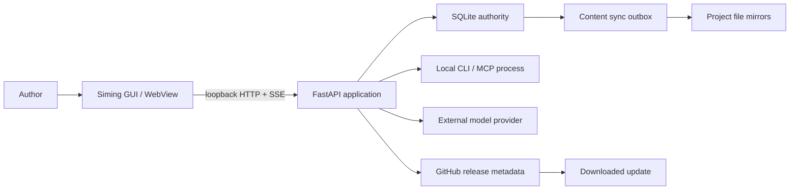

# Siming 3.0 Threat Model

Status: RC review
Scope: Windows desktop executable, loopback FastAPI service, SQLite data, local CLI/MCP integrations, model providers, updater and GitHub Releases.

## Assumptions

- Siming is a single-user desktop application running under the author's Windows account.
- The GUI and API run on the same computer. The packaged server binds only to `127.0.0.1`.
- SQLite is the authoritative store. Project Markdown and JSON files are derived mirrors.
- Model APIs and third-party CLIs are outside Siming's trust boundary.
- A process already running with the author's Windows permissions can read or modify the author's files; Siming does not claim to isolate the user from local malware.
- No behavioral analytics or novel content is sent to a Siming-operated cloud service.

Open question: Authenticode signing is not yet available. Until signing is configured, the secure updater rejects unsigned builds and users must install a verified release manually.

## Assets

| Asset | Security goal |
| --- | --- |
| Novel text, outlines, character and continuity data | Confidentiality, integrity, recoverability |
| SQLite database and migration backups | Integrity, availability |
| API keys, CLI credentials and one-time login input | Confidentiality; never log or return raw values |
| Model selection and prompts | Integrity and user control |
| Tool permissions and write confirmation | Prevent unauthorized project mutations |
| Release executable and update metadata | Authenticity and integrity |
| Operation checkpoints and content-sync queue | Consistent recovery after interruption |

## Trust Boundaries

1. Browser/WebView to loopback API: untrusted web pages can probe localhost. Host validation and an Origin guard protect browser writes.
2. API to SQLite: command use cases own transactions through Unit of Work. Files are not accepted as an implicit source of truth.
3. Database to mirrors: a durable outbox runs only after commit. Failed projections remain retryable.
4. API to CLI/MCP: subprocess output, prompts and tool requests are untrusted. Permission packs and write confirmation constrain effects.
5. API to model providers: selected context leaves the computer. Provider privacy and retention terms apply.
6. Updater to GitHub: SHA-256 detects corruption; Authenticode establishes publisher trust when signed assets are available.

## Threats And Controls

### T1: Malicious Website Writes To Local API

- Attack: a page opened in the user's browser sends a POST to a known localhost port.
- Impact: project deletion, prompt changes or model configuration changes.
- Controls: loopback bind, `TrustedHostMiddleware`, rejection of non-loopback browser origins, explicit CORS configuration and write confirmation for MCP tools.
- Evidence: `app/bootstrap/http_security.py`, `tests/test_http_security.py`.
- Residual risk: non-browser local processes do not send Origin and are allowed. This matches the local API/CLI design and does not protect against malware running as the user.

### T2: DNS Rebinding Or Host Header Confusion

- Attack: a hostile hostname resolves to `127.0.0.1` and reaches the local server with an attacker-controlled Host header.
- Controls: accepted hosts are limited to `127.0.0.1`, `localhost` and the test-only `testserver` host.
- Residual risk: changing the launcher to bind beyond loopback would invalidate this model and requires a new authentication design.

### T3: Frontend Path Escape

- Attack: encoded `..` segments or a symlink attempt to read files outside bundled frontend assets.
- Controls: every fallback file path is resolved and must remain under the resolved frontend distribution root.
- Evidence: `resolve_frontend_file()` and its traversal regression test.

### T4: Database Damage During Upgrade

- Attack/failure: process interruption, incompatible legacy shape or migration defect causes data loss.
- Controls: known-schema classification, unknown-schema read-only recovery, SQLite online backup including committed WAL pages, destination integrity check, transactional Alembic execution and a rehearsal tool that never mutates the source database.
- Evidence: `app/database/backup.py`, `scripts/rehearse_database_migration.py`, database bootstrap and rehearsal tests.
- Residual risk: disk failure can affect both database and local backups. Authors still need an external backup strategy.

### T5: CLI Writes Files Without Entering The Database

- Attack/failure: an Agent creates `chapters/*.md` directly, causing the GUI and mirror to disagree.
- Controls: SQLite is the only write authority; CLI prompts require workspace tools; orphan detection exposes import, overwrite and ignore actions; content sync is post-commit.
- Residual risk: a local process can still edit mirrors. Such files are treated as untrusted repair input, never as silent database updates.

### T6: Prompt Injection Escalates Tool Access

- Attack: imported prose or web research tells the model to reveal secrets or invoke destructive tools.
- Controls: ToolSpec permission metadata, MCP list/call enforcement, secret-name deny rules, least-privilege packs, confirmation for writes and separation between generated text and application commands.
- Residual risk: permitted tools may still receive poor arguments. Review mode and version checkpoints remain important for high-impact edits.

### T7: Credential Disclosure

- Attack/failure: API keys appear in logs, model prompts, MCP responses or onboarding events.
- Controls: encrypted-at-rest configuration, redacted diagnostics, one-time credential delivery to managed CLI processes and no credential tools in the workspace registry.
- Residual risk: third-party CLIs manage their own credential stores and security posture.

### T8: Untrusted Model Or Provider Output

- Attack/failure: malformed JSON, empty output, fabricated completion or quota messages corrupt workflow state.
- Controls: shared ModelResult/OperationResult semantics, schema validation, failure classification, checkpoints and no mapping of empty/blocked results to generic completion.
- Residual risk: generated prose and factual quality require author review.

### T9: Update Supply-Chain Compromise

- Attack: a tampered executable or release metadata is installed.
- Controls: exact-tag release builds, SHA-256 asset agreement, GitHub CI gates and mandatory Authenticode verification before automatic installation.
- Residual risk: current public builds are unsigned, so automatic update installation intentionally fails closed. Manual installers must be downloaded only from the official repository and checked against `sha256.txt`.

### T10: Long-Running Task Denial Of Service

- Attack/failure: a CLI process consumes resources indefinitely or a disconnected frontend mistakes activity for a stall.
- Controls: operation health is separate from lifecycle, process-tree CPU/I/O/output/checkpoint signals detect progress, genuine stalls pause at the current unit and completed checkpoints remain committed.
- Residual risk: a legitimately expensive model can still consume substantial CPU, disk or provider quota; the task center provides cancel and retry controls.

## Security Invariants

- The packaged HTTP server binds to loopback only.
- Database writes commit only through Unit of Work or the independent event writer.
- File mirrors are never an implicit write authority.
- Secrets never enter tool schemas, prompts, operation events or user-visible diagnostics.
- Unknown database structures never receive guessed migrations.
- Release assets must match their tag, version and SHA-256; unsigned updates are not auto-installed.

Revisit this model when adding network listening, multi-user access, cloud sync, plugins with arbitrary code, a new update source or a different credential store.
